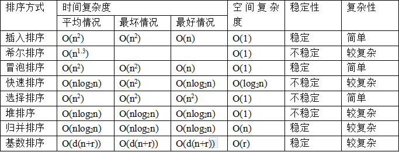

## 大数据算法
https://blog.csdn.net/zhushuai1221/article/details/51781002
1. 大数据量排序
2. 10亿个数字里找最小的10个
3. 1亿个数，其中有2个是重复的，快速找到，时间空间复杂度最优
4. 2亿个随机生成的无序数，快速找到中间大小的值
5. 很长字符串，重复的字符排重
6. 无限的字符流中, 随机选出 10 个字符（**蓄水池采样算法**）

## 排序算法

