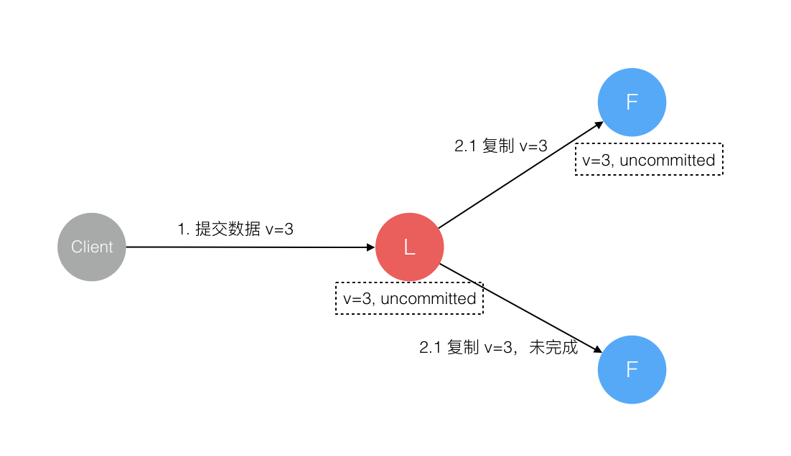

## etcd & raft

[Raft共识算法](http://www.calvinneo.com/2019/03/12/raft-algorithm/)

[Raft协议详解-基础知识和leader选举](https://zhuanlan.zhihu.com/p/29130892)

[raft原理（一）：选主与日志复制](http://oserror.com/distributed/raft-principle-one/)

## raft一致性

> raft在leader故障的情况下，怎么保证竞选leader的follower数据不丢失？

Raft 协议强依赖 Leader 节点的可用性来确保集群数据的一致性。数据的流向只能从 Leader 节点向 Follower 节点转移。当 Client 向集群 Leader 节点提交数据后，Leader 节点接收到的数据处于未提交状态（Uncommitted），接着 Leader 节点会并发向所有 Follower 节点复制数据并等待接收响应，确保至少集群中超过半数节点已接收到数据后再向 Client 确认数据已接收。一旦向 Client 发出数据接收 Ack 响应后，表明此时数据状态进入已提交（Committed），Leader 节点再向 Follower 节点发通知告知该数据状态已提交。

在这个过程中，主节点可能在任意阶段挂掉，看下 Raft 协议如何针对不同阶段保障数据一致性的。

1. 数据到达 Leader 节点前
这个阶段 Leader 挂掉不影响一致性，不多说。

2. 数据到达 Leader 节点，但未复制到 Follower 节点
这个阶段 Leader 挂掉，数据属于未提交状态，Client 不会收到 Ack 会认为超时失败可安全发起重试。Follower 节点上没有该数据，重新选主后 Client 重试重新提交可成功。原来的 Leader 节点恢复后作为 Follower 加入集群重新从当前任期的新 Leader 处同步数据，强制保持和 Leader 数据一致。

3. 数据到达 Leader 节点，成功复制到 Follower 所有节点，但还未向 Leader 响应接收
这个阶段 Leader 挂掉，虽然数据在 Follower 节点处于未提交状态（Uncommitted）但保持一致，重新选出 Leader 后可完成数据提交，此时 Client 由于不知到底提交成功没有，可重试提交。针对这种情况 Raft 要求 RPC 请求实现幂等性，也就是要实现内部去重机制。

4. 数据到达 Leader 节点，成功复制到 Follower 部分节点，但还未向 Leader 响应接收
这个阶段 Leader 挂掉，数据在 Follower 节点处于未提交状态（Uncommitted）且不一致，Raft 协议要求投票只能投给拥有最新数据的节点。所以拥有最新数据的节点会被选为 Leader 再强制同步数据到 Follower，数据不会丢失并最终一致。

5. 数据到达 Leader 节点，成功复制到 Follower 所有或多数节点，数据在 Leader 处于已提交状态，但在 Follower 处于未提交状态
这个阶段 Leader 挂掉，重新选出新 Leader 后的处理流程和阶段 3 一样。

6. 数据到达 Leader 节点，成功复制到 Follower 所有或多数节点，数据在所有节点都处于已提交状态，但还未响应 Client
这个阶段 Leader 挂掉，Cluster 内部数据其实已经是一致的，Client 重复重试基于幂等策略对一致性无影响。

7. 网络分区导致的脑裂情况，出现双 Leader
网络分区将原先的 Leader 节点和 Follower 节点分隔开，Follower 收不到 Leader 的心跳将发起选举产生新的 Leader。这时就产生了双 Leader，原先的 Leader 独自在一个区，向它提交数据不可能复制到多数节点所以永远提交不成功。向新的 Leader 提交数据可以提交成功，网络恢复后旧的 Leader 发现集群中有更新任期（Term）的新 Leader 则自动降级为 Follower 并从新 Leader 处同步数据达成集群数据一致。

综上穷举分析了最小集群（3 节点）面临的所有情况，可以看出 Raft 协议都能很好的应对一致性问题，并且很容易理解。