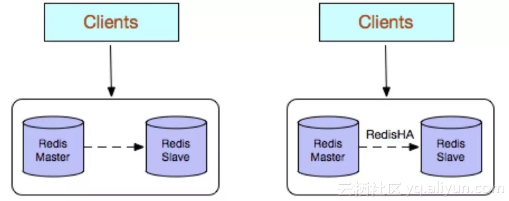
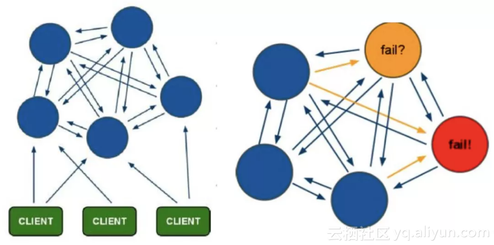
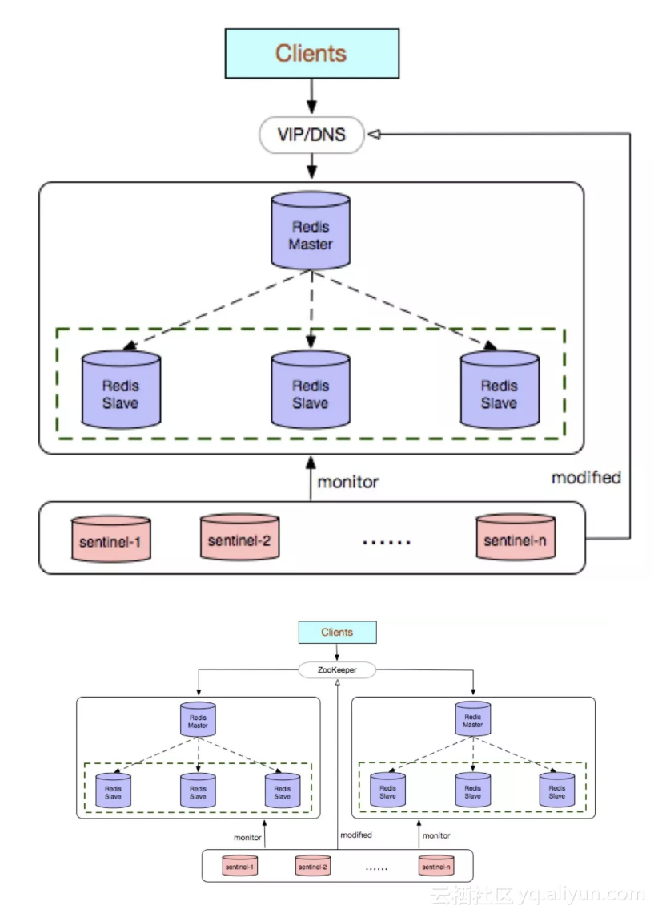

## Redis

[Redis 数据结构和对象系统](https://juejin.im/post/5d067941f265da1bb13f30d2)

Redis数据结构字典使用的hash算法是 **MurmurHash2** 算法，该算法也是Memcached、nginx使用的一致性hash算法

[Redis分布式锁的实现原理](https://juejin.im/post/5bf3f15851882526a643e207)

[使用 Redis的SETNX命令实现分布式锁](https://www.jianshu.com/p/c970cc71070b)

[redis常用场景](https://zhuanlan.zhihu.com/p/29665317)

[redis加锁的几种实现](http://ukagaka.github.io/php/2017/09/21/redisLock.html)

[谈谈Redis的SETNX](https://blog.huoding.com/2015/09/14/463)

[Redis持久化----RDB和AOF 的区别](https://blog.csdn.net/ljheee/article/details/76284082)

### Redis对象与底层数据结构

1. Redis对象

| 类型常量     | 对象的名称   | 底层数据结构                                      |
| ------------ | ------------ | ------------------------------------------------- |
| REDIS_STRING | 字符串对象   | INT、EMBSTR、RAW                                  |
| REDIS_LIST   | 列表对象     | ZIPLIST(元素不多且元素不大的时候)、LINKEDLIST     |
| REDIS_HASH   | 哈希对象     | ZIPLIST(元素不多且元素不大的时候)、HT             |
| REDIS_SET    | 集合对象     | INTSET、HT                                        |
| REDIS_ZSET   | 有序集合对象 | ZIPLIST(元素不多且元素不大的时候)、SKIPLIST配合HT |

2. Redis底层数据结构

| 编码常量                  | 编码所对应的底层数据结构    |
| ------------------------- | --------------------------- |
| REDIS_ENCODING_INT        | long 类型的整数             |
| REDIS_ENCODING_EMBSTR     | embstr 编码的简单动态字符串 |
| REDIS_ENCODING_RAW        | 简单动态字符串              |
| REDIS_ENCODING_HT         | 字典                        |
| REDIS_ENCODING_LINKEDLIST | 双端链表                    |
| REDIS_ENCODING_ZIPLIST    | 压缩列表                    |
| REDIS_ENCODING_INTSET     | 整数集合                    |
| REDIS_ENCODING_SKIPLIST   | 跳跃表               |

参考： 

[Redis的五种对象类型及其底层实现](https://blog.csdn.net/caishenfans/article/details/44784131)

[Redis内部数据结构详解(7)——intset](http://zhangtielei.com/posts/blog-redis-intset.html)

[Redis内部数据结构详解(6)——skiplist](http://zhangtielei.com/posts/blog-redis-skiplist.html)

[Redis内部数据结构详解(5)——quicklist](http://zhangtielei.com/posts/blog-redis-quicklist.html)

[Redis内部数据结构详解(4)——ziplist](http://zhangtielei.com/posts/blog-redis-ziplist.html)

[Redis内部数据结构详解(3)——robj](http://zhangtielei.com/posts/blog-redis-robj.html)

[Redis内部数据结构详解(2)——sds](http://zhangtielei.com/posts/blog-redis-sds.html)

[Redis内部数据结构详解(1)——dict](http://zhangtielei.com/posts/blog-redis-dict.html)

### Redis内存管理

#### redis 设置过期时间

Redis中有个设置时间过期的功能，即对存储在 redis 数据库中的值可以设置一个过期时间。作为一个缓存数据库，这是非常实用的。如我们一般项目中的 token 或者一些登录信息，尤其是短信验证码都是有时间限制的，按照传统的数据库处理方式，一般都是自己判断过期，这样无疑会严重影响项目性能。

我们 set key 的时候，都可以给一个 expire time，就是过期时间，通过过期时间我们可以指定这个 key 可以存活的时间。

如果假设你设置了一批 key 只能存活1个小时，那么接下来1小时后，redis是怎么对这批key进行删除的？

**定期删除+惰性删除。**

通过名字大概就能猜出这两个删除方式的意思了。

* 定期删除：redis默认是每隔 100ms 就随机抽取一些设置了过期时间的key，检查其是否过期，如果过期就删除。注意这里是随机抽取的。为什么要随机呢？你想一想假如 redis 存了几十万个 key ，每隔100ms就遍历所有的设置过期时间的 key 的话，就会给 CPU 带来很大的负载！
* 惰性删除 ：定期删除可能会导致很多过期 key 到了时间并没有被删除掉。所以就有了惰性删除。假如你的过期 key，靠定期删除没有被删除掉，还停留在内存里，除非你的系统去查一下那个 key，才会被redis给删除掉。这就是所谓的惰性删除，也是够懒的哈！
* 
但是仅仅通过设置过期时间还是有问题的。我们想一下：如果定期删除漏掉了很多过期 key，然后你也没及时去查，也就没走惰性删除，此时会怎么样？如果大量过期key堆积在内存里，导致redis内存块耗尽了。怎么解决这个问题呢？ **redis 内存淘汰机制**。

#### Redis内存淘汰机制

redis 提供 6种数据淘汰策略：

* volatile-lru：从已设置过期时间的数据集（server.db[i].expires）中挑选最近最少使用的数据淘汰
* volatile-ttl：从已设置过期时间的数据集（server.db[i].expires）中挑选将要过期的数据淘汰
* volatile-random：从已设置过期时间的数据集（server.db[i].expires）中任意选择数据淘汰
* allkeys-lru：当内存不足以容纳新写入数据时，在键空间中，移除最近最少使用的key（这个是最常用的）
* allkeys-random：从数据集（server.db[i].dict）中任意选择数据淘汰
* no-eviction：禁止驱逐数据，也就是说当内存不足以容纳新写入数据时，新写入操作会报错。这个应该没人使用吧！

4.0版本后增加以下两种：
* volatile-lfu：从已设置过期时间的数据集(server.db[i].expires)中挑选最不经常使用的数据淘汰
* allkeys-lfu：当内存不足以容纳新写入数据时，在键空间中，移除最不经常使用的key

### redis 事务
Redis 通过 MULTI、EXEC、WATCH 等命令来实现事务(transaction)功能。事务提供了一种将多个命令请求打包，然后一次性、按顺序地执行多个命令的机制，并且在事务执行期间，服务器不会中断事务而改去执行其他客户端的命令请求，它会将事务中的所有命令都执行完毕，然后才去处理其他客户端的命令请求。

在传统的关系式数据库中，常常用 ACID 性质来检验事务功能的可靠性和安全性。在 Redis 中，事务总是具有**原子性（Atomicity）、一致性（Consistency）和隔离性（Isolation）**，并且当 Redis 运行在某种特定的持久化模式下时，事务也具有**持久性（Durability）**。

### redis高可用

redis常见高可用方式：主从、集群、哨兵

#### 主从

Redis多副本，采用主从（replication）部署结构，相较于单副本而言最大的特点就是主从实例间数据实时同步，并且提供数据持久化和备份策略。主从实例部署在不同的物理服务器上，根据公司的基础环境配置，可以实现同时对外提供服务和读写分离策略。

优点：

* 高可靠性：一方面，采用双机主备架构，能够在主库出现故障时自动进行主备切换，从库提升为主库提供服务，保证服务平稳运行；另一方面，开启数据持久化功能和配置合理的备份策略，能有效的解决数据误操作和数据异常丢失的问题；
* 读写分离策略：从节点可以扩展主库节点的读能力，有效应对大并发量的读操作。

缺点：
* 故障恢复复杂，如果没有RedisHA系统（需要开发），当主库节点出现故障时，需要手动将一个从节点晋升为主节点，同时需要通知业务方变更配置，并且需要让其它从库节点去复制新主库节点，整个过程需要人为干预，比较繁琐；
* 主库的写能力受到单机的限制，可以考虑分片；
* 主库的存储能力受到单机的限制，可以考虑Pika；
* 原生复制的弊端在早期的版本中也会比较突出，如：Redis复制中断后，Slave会发起psync，此时如果同步不成功，则会进行全量同步，主库执行全量备份的同时可能会造成毫秒或秒级的卡顿；又由于COW机制，导致极端情况下的主库内存溢出，程序异常退出或宕机；主库节点生成备份文件导致服务器磁盘IO和CPU（压缩）资源消耗；发送数GB大小的备份文件导致服务器出口带宽暴增，阻塞请求，建议升级到最新版本。

#### 集群

Redis Cluster是社区版推出的Redis分布式集群解决方案，主要解决Redis分布式方面的需求，比如，当遇到单机内存，并发和流量等瓶颈的时候，Redis Cluster能起到很好的负载均衡的目的。

Redis Cluster集群节点最小配置6个节点以上（3主3从），其中主节点提供读写操作，从节点作为备用节点，不提供请求，只作为故障转移使用。

Redis Cluster采用虚拟槽分区，所有的键根据哈希函数映射到0～16383个整数槽内，每个节点负责维护一部分槽以及槽所印映射的键值数据。

优点：
* 无中心架构；
* 数据按照slot存储分布在多个节点，节点间数据共享，可动态调整数据分布；
* 可扩展性：可线性扩展到1000多个节点，节点可动态添加或删除；
* 高可用性：部分节点不可用时，集群仍可用。通过增加Slave做standby数据副本，能够实现故障自动failover，节点之间通过gossip协议交换状态信息，用投票机制完成Slave到Master的角色提升；
* 降低运维成本，提高系统的扩展性和可用性。

缺点：
* Client实现复杂，驱动要求实现Smart Client，缓存slots mapping信息并及时更新，提高了开发难度，客户端的不成熟影响业务的稳定性。目前仅JedisCluster相对成熟，异常处理部分还不完善，比如常见的“max redirect exception”。
* 节点会因为某些原因发生阻塞（阻塞时间大于clutser-node-timeout），被判断下线，这种failover是没有必要的。
* 数据通过异步复制，不保证数据的强一致性。
* 多个业务使用同一套集群时，无法根据统计区分冷热数据，资源隔离性较差，容易出现相互影响的情况。
* Slave在集群中充当“冷备”，不能缓解读压力，当然可以通过SDK的合理设计来提高Slave资源的利用率。
* Key批量操作限制，如使用mset、mget目前只支持具有相同slot值的Key执行批量操作。对于映射为不同slot值的Key由于Keys不支持跨slot查询，所以执行mset、mget、sunion等操作支持不友好。
* Key事务操作支持有限，只支持多key在同一节点上的事务操作，当多个Key分布于不同的节点上时无法使用事务功能。
* Key作为数据分区的最小粒度，不能将一个很大的键值对象如hash、list等映射到不同的节点。
* 不支持多数据库空间，单机下的redis可以支持到16个数据库，集群模式下只能使用1个数据库空间，即db 0。
* 复制结构只支持一层，从节点只能复制主节点，不支持嵌套树状复制结构。
* 避免产生hot-key，导致主库节点成为系统的短板。
* 避免产生big-key，导致网卡撑爆、慢查询等。
* 重试时间应该大于cluster-node-time时间。
* Redis Cluster不建议使用pipeline和multi-keys操作，减少max redirect产生的场景。

#### 哨兵

Redis Sentinel是社区版本推出的原生高可用解决方案，其部署架构主要包括两部分：Redis Sentinel集群和Redis数据集群。

其中Redis Sentinel集群是由若干Sentinel节点组成的分布式集群，可以实现故障发现、故障自动转移、配置中心和客户端通知。Redis Sentinel的节点数量要满足2n+1（n>=1）的奇数个。

优点：
* Redis Sentinel集群部署简单；
* 能够解决Redis主从模式下的高可用切换问题；
* 很方便实现Redis数据节点的线形扩展，轻松突破Redis自身单线程瓶颈，可极大满足Redis大容量或高性能的业务需求；
* 可以实现一套Sentinel监控一组Redis数据节点或多组数据节点。

缺点：

* 部署相对Redis主从模式要复杂一些，原理理解更繁琐；
* 资源浪费，Redis数据节点中slave节点作为备份节点不提供服务；
* Redis Sentinel主要是针对Redis数据节点中的主节点的高可用切换，对Redis的数据节点做失败判定分为主观下线和客观下线两种，对于Redis的从节点有对节点做主观下线操作，并不执行故障转移。
* 不能解决读写分离问题，实现起来相对复杂。

建议：
* 如果监控同一业务，可以选择一套Sentinel集群监控多组Redis数据节点的方案，反之选择一套Sentinel监控一组Redis数据节点的方案。
* sentinel monitor <master-name> <ip> <port> <quorum> 配置中的<quorum>建议设置成Sentinel节点的一半加1，当Sentinel部署在多个IDC的时候，单个IDC部署的Sentinel数量不建议超过（Sentinel数量 – quorum）。
* 合理设置参数，防止误切，控制切换灵敏度控制：
    1. quorum
    2. down-after-milliseconds 30000
    3. failover-timeout 180000
    4. maxclient
    5. timeout

* 部署的各个节点服务器时间尽量要同步，否则日志的时序性会混乱。
* Redis建议使用pipeline和multi-keys操作，减少RTT次数，提高请求效率。
* 自行搞定配置中心（zookeeper），方便客户端对实例的链接访问。

参考：https://yq.aliyun.com/articles/626532

### 缓存雪崩和缓存穿透

#### 缓存雪崩

简介：缓存同一时间大面积的失效，所以，后面的请求都会落到数据库上，造成数据库短时间内承受大量请求而崩掉。

解决办法：
* 事前：尽量保证整个 redis 集群的高可用性，发现机器宕机尽快补上。选择合适的内存淘汰策略。
* 事中：本地ehcache缓存 + hystrix限流&降级，避免MySQL崩掉
* 事后：利用 redis 持久化机制保存的数据尽快恢复缓存

#### 缓存穿透

简介：一般是黑客故意去请求缓存中不存在的数据，导致所有的请求都落到数据库上，造成数据库短时间内承受大量请求而崩掉。

解决办法： 有很多种方法可以有效地解决缓存穿透问题，最常见的则是采用布隆过滤器，将所有可能存在的数据哈希到一个足够大的bitmap中，一个一定不存在的数据会被 这个bitmap拦截掉，从而避免了对底层存储系统的查询压力。另外也有一个更为简单粗暴的方法（我们采用的就是这种），如果一个查询返回的数据为空（不管是数 据不存在，还是系统故障），我们仍然把这个空结果进行缓存，但它的过期时间会很短，最长不超过五分钟。

参考：

https://blog.csdn.net/zeb_perfect/article/details/54135506

### Redis典型场景

[redis学习（八）——redis应用场景](https://www.cnblogs.com/xiaoxi/p/7007695.html)

[Redis的7个应用场景](https://www.cnblogs.com/NiceCui/p/7794659.html)

[Redis 原理及应用（4）--Redis应用场景分析](https://blog.csdn.net/u013679744/article/details/79209341)

### Redis和memcached对比

1. redis支持更丰富的数据类型（支持更复杂的应用场景）：Redis不仅仅支持简单的k/v类型的数据，同时还提供list，set，zset，hash等数据结构的存储。memcache支持简单的数据类型，String。

2. Redis支持数据的持久化，可以将内存中的数据保持在磁盘中，重启的时候可以再次加载进行使用,而Memecache把数据全部存在内存之中。

3. 集群模式：memcached没有原生的集群模式，需要依靠客户端来实现往集群中分片写入数据；但是 redis 目前是原生支持 cluster 模式的.

4. Memcached是多线程，非阻塞IO复用的网络模型；Redis使用单线程的多路 IO 复用模型。