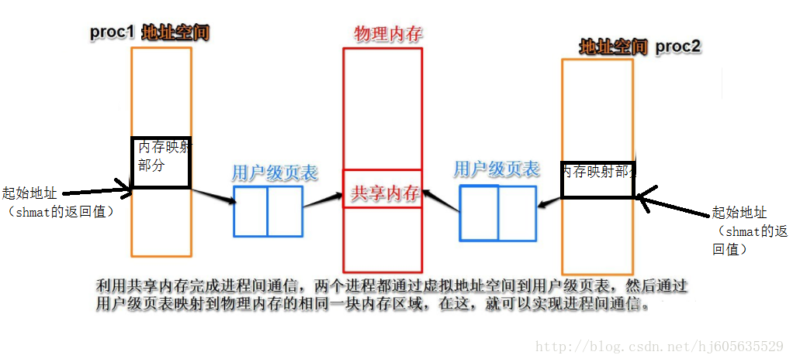
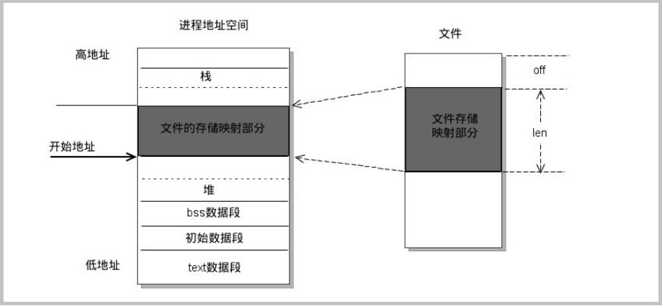

# Linux 共享内存

## 定义

**共享内存定义**：共享内存是最快的可用IPC（进程间通信）形式。它允许多个不相关的进程去访问同一部分逻辑内存。共享内存是由IPC为一个进程创建的一个特殊的地址范围，它将出现在进程的地址空间中。其他进程可以把同一段共享内存段“连接到”它们自己的地址空间里去。所有进程都可以访问共享内存中的地址。如果一个进程向这段共享内存写了数据，所做的改动会立刻被有访问同一段共享内存的其他进程看到。因此共享内存对于数据的传输是非常高效的。

共享内存段被映射进进程空间之后，在进程空间中，共享内存段紧靠在栈之下，最大限制为32M。

## 实现方式

### shm

每个进程中的共享内存部分都映射到了同一块物理内存中。即是在物理内存中创建了一块空间，让进程一起使用。

### mmap

简单来说就是mmap是在磁盘上建立一个文件，每个进程地址空间中开辟出一块空间与这个文件进行映射。

## 总结
1. mmap是在磁盘上建立一个文件，每个进程地址空间中开辟出一块空间进行映射。而对于shm而言，shm每个进程最终会映射到同一块物理内存。shm保存在物理内存，这样读写的速度要比磁盘要快，但是存储量不是特别大。

2. 相对于shm来说，mmap更加简单，调用更加方便，所以这也是大家都喜欢用的原因。
   
3. 另外mmap有一个好处是当机器重启，因为mmap把文件保存在磁盘上，这个文件还保存了操作系统同步的映像，所以mmap不会丢失，但是shmget就会丢失。

4. shm保存在物理内存，这样读写的速度肯定要比磁盘要快，但是存储量不是特别大。mmap将需要的数据再读入到内存中，可以处理大文件。

5. 共享内存是在内存中创建空间，每个进程映射到此处。内存映射是创建一个文件，并且映射到每个进程开辟的空间中。

