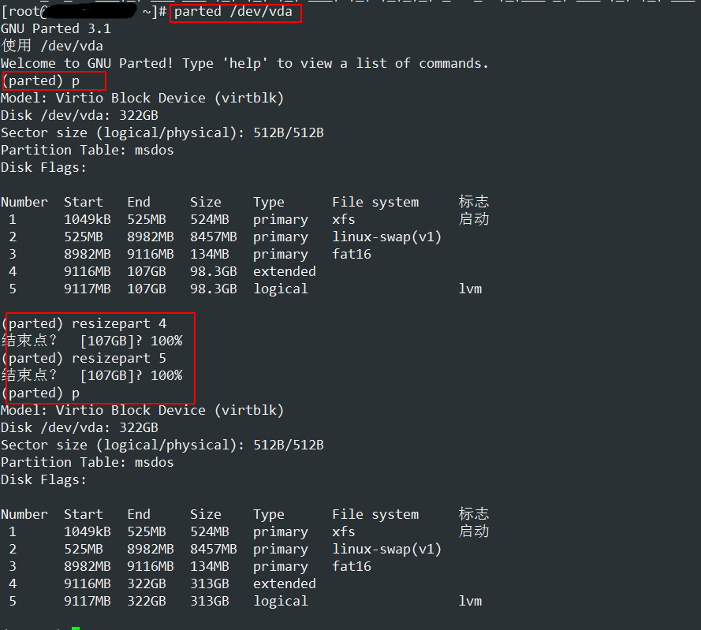

## 查看目录大小
## du
1. 要显示一个目录树及其每个子树的磁盘使用情况
```bash
du /home/linux
```
这在/home/linux目录及其每个子目录中显示了磁盘块数。

2. 要通过以1024字节为单位显示一个目录树及其每个子树的磁盘使用情况
```bash
du -k /home/linux
```
这在/home/linux目录及其每个子目录中显示了 1024 字节磁盘块数。

3. 以MB为单位显示一个目录树及其每个子树的磁盘使用情况
```bash
du -m /home/linux
```
这在/home/linux目录及其每个子目录中显示了 MB 磁盘块数。

4. 以GB为单位显示一个目录树及其每个子树的磁盘使用情况
```bash
du -g /home/linux
```
这在/home/linux目录及其每个子目录中显示了 GB 磁盘块数。

5. 查看当前目录下所有目录以及子目录的大小：
```bash
du -h .
```
“.”代表当前目录下。也可以换成一个明确的路径，-h表示用K、M、G的人性化形式显示

6. 查看当前目录下user目录的大小，并不想看其他目录以及其子目录：
```bash
du -sh user
```
-s表示总结的意思，即只列出一个总结的值
```bash
du -h --max-depth=0 user
```
--max-depth=n表示只深入到第n层目录，此处设置为0，即表示不深入到子目录。

7. 列出user目录及其子目录下所有目录和文件的大小：
```bash
du -ah user
```
-a表示包括目录和文件

8. 列出当前目录中的目录名不包括xyz字符串的目录的大小：
```bash
du -h --exclude='*xyz*'
```

9. 想在一个屏幕下列出更多的关于user目录及子目录大小的信息：
```bash
du -0h user
```
-0（杠零）表示每列出一个目录的信息，不换行，而是直接输出下一个目录的信息。

10. 只显示一个目录树的全部磁盘使用情况
```bash
du -s /home/linux
```

11. 查看各文件夹大小: du -h --max-depth=1

## 持久化mount挂载
要让系统每次都自动挂载，那么就应该修改/etc/fstab文件,在后面添加：
```bash
/dev/sda2   /mnt   ext3  auto   0 0
```

对于该文件的说明：
* 第4列为挂载选项，详细参考man mount. 下面列出一些常用的选项：
    * auto: 系统自动挂载，fstab默认就是这个选项
    * ro: read-only
    * rw: read-write
    * defaults: rw, suid, dev, exec, auto, nouser, and async.
* 第5列为dump选项，设置是否让备份程序dump备份文件系统，0为忽略，1为备份。
* 第6列为fsck选项，告诉fsck程序以什么顺序检查文件系统，0为忽略。

## lvm扩容

### 增加卷组扩容
```shell
# 创建分区
fdisk /dev/sdb

# 创建物理卷
pvcreat /dev/sdb1

# 查看卷组名称及使用情况
vgdisplay

# 将物理卷扩展到卷组
vgextend centos /dev/sdb1

# 将卷组中空闲空间扩展到 /home
lvextend -l +100%FREE /dev/mapper/centos-opt

# 刷新文件系统是扩容生效
xfs_growfs /dev/mapper/centos-opt
```

### 压缩
```shell
umount /opt  #卸载opt目录，无法卸载：fuser –m –v –i -k
xfs_repair /dev/mapper/centos_opt  #检查逻辑分区文件系统的错误
lvresize -L 1G /dev/mapper/centos_opt   #调整大小为1G
mount –a    #发现无法挂载
mkfs.xfs /dev/mapper/centos_opt -f    #重新格式化分区
mount /opt     #重新挂载
```

### 虚拟机扩容操作

1. 编辑虚拟机磁盘，扩大磁盘容量，本例子扩大到300G；
2. 虚拟机内部查看磁盘容量信息
```shell
[root@OS ~]# lsblk
NAME                        MAJ:MIN RM  SIZE RO TYPE MOUNTPOINT
vda                         252:0    0  300G  0 disk
├─vda1                      252:1    0  500M  0 part /boot
├─vda2                      252:2    0  7.9G  0 part [SWAP]
├─vda3                      252:3    0  128M  0 part /boot/efi
├─vda4                      252:4    0    1K  0 part
└─vda5                      252:5    0 91.5G  0 part
  ├─centos_os-root 253:0    0 45.8G  0 lvm  /
  └─centos_os-opt  253:1    0 45.8G  0 lvm  /opt
```
3. 使用parted命令扩容拓展卷


4. 查看pv卷
```shell
[root@OS ~]# pvdisplay
  --- Physical volume ---
  PV Name               /dev/vda5
  VG Name               centos_os
  PV Size               91.51 GiB / not usable 0
  Allocatable           yes
  PE Size               4.00 MiB
  Total PE              23426
  Free PE               10
  Allocated PE          23416
  PV UUID               mJ923c-D54p-kIYx-Dc0H-JcOZ-cuMc-WvOj7u
```
5. 拓展pv卷
    ```shell
    # 查看可用的/dev/vda5的大小
    [root@OS ~]# lsblk
    NAME                        MAJ:MIN RM   SIZE RO TYPE MOUNTPOINT
    vda                         252:0    0   300G  0 disk
    ├─vda1                      252:1    0   500M  0 part /boot
    ├─vda2                      252:2    0   7.9G  0 part [SWAP]
    ├─vda3                      252:3    0   128M  0 part /boot/efi
    ├─vda4                      252:4    0   512B  0 part
    └─vda5                      252:5    0 291.5G  0 part
      ├─centos_os-root 253:0    0  45.8G  0 lvm  /
      └─centos_os-opt  253:1    0  45.8G  0 lvm  /opt

    # 扩容pv，扩容大小小余最大大小，否则可能因为四舍五入的原因导致一些问题
    pvresize --setphysicalvolumesize 291.5G /dev/vda5

    # 查看扩容结果
    [root@OS ~]# pvdisplay
      --- Physical volume ---
      PV Name               /dev/vda5
      VG Name               centos_os
      PV Size               291.50 GiB / not usable 3.00 MiB
      Allocatable           yes
      PE Size               4.00 MiB
      Total PE              74623
      Free PE               51207
      Allocated PE          23416
      PV UUID               mJ923c-D54p-kIYx-Dc0H-JcOZ-cuMc-WvOj7u
    ```

6. 扩容逻辑卷
    ```shell
    # 扩容逻辑卷
    lvextend -l +100%FREE /dev/mapper/centos_os-opt

    # 查看扩容结果
    [root@OS ~]# lsblk
    NAME                        MAJ:MIN RM   SIZE RO TYPE MOUNTPOINT
    vda                         252:0    0   300G  0 disk
    ├─vda1                      252:1    0   500M  0 part /boot
    ├─vda2                      252:2    0   7.9G  0 part [SWAP]
    ├─vda3                      252:3    0   128M  0 part /boot/efi
    ├─vda4                      252:4    0   512B  0 part
    └─vda5                      252:5    0 291.5G  0 part
      ├─centos_os-root 253:0    0  45.8G  0 lvm  /
      └─centos_os-opt  253:1    0 245.8G  0 lvm  /opt
    ```
7. 刷新文件系统使扩容生效
    ```shell
    xfs_growfs /dev/mapper/centos-opt
    ```
