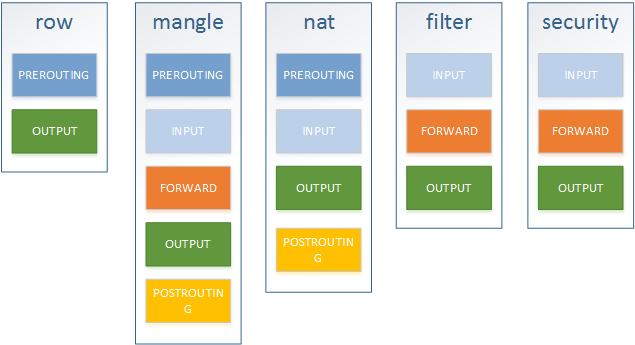
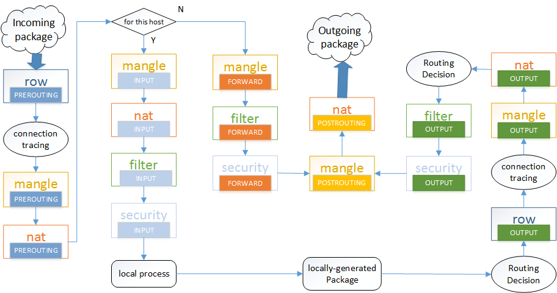

# iptables

netfilter/iptables IP 信息包过滤系统是一种功能强大的工具， 可用于添加、编辑和除去规则，这些规则是在做信息包过滤决定时，防火墙所遵循和组成的规则。这些规则存储在专用的信息包过滤表中，而这些表集成在 Linux 内核中。 在信息包过滤表中，规则被分组放在我们所谓的链（chain）中。我马上会详细讨论这些规则以及如何建立这些规则并将它们分组在链中。

虽然 netfilter/iptables IP 信息包过滤系统被称为单个实体，但它实际上由两个组件 netfilter和 iptables 组成。

netfilter 组件也称为 内核空间（kernelspace），是内核的一部分，由一些信息包过滤表组成， 这些表包含内核用来控制信息包过滤处理的规则集。

iptables 组件是一种工具，也称为 用户空间（userspace），它使插入、修改和除去信息包过滤表中的规则变得容易。

## 表和链

### 表

表是包含仅处理特定类型信息包的规则和链的信息包过滤表。表示相同功能的规则的集合，以下描述了各表规则对应的功能（按执行顺序排列）：
* row表：用于决定数据包是否被状态跟踪机制处理
* mangle表：解析修改报文并重新封装
* nat表：用于网络地址转换
* filter表：用于过滤、防火墙
* security表：用于根据安全策略处理数据包

### 链

链就是一串规则的集合，iptables中包含了5条链：
* PREROUTING: 数据包进入路由表之前.
* INPUT: 通过路由表后目的地为本机.
* FORWARDING: 通过路由表后, 目的地不为本机.
* OUTPUT: 由本机产生, 向外转发.
* POSTROUTIONG: 发送到网卡接口之前.

### 表和链的关系

下图展示了netfilter中表和链之间的关系：



```shell
# iptables -t raw -vnL
Chain PREROUTING (policy ACCEPT 0 packets, 0 bytes)
 pkts bytes target     prot opt in     out     source               destination

Chain OUTPUT (policy ACCEPT 0 packets, 0 bytes)
 pkts bytes target     prot opt in     out     source               destination

# iptables -t nat -vnL
Chain PREROUTING (policy ACCEPT 0 packets, 0 bytes)
 pkts bytes target     prot opt in     out     source               destination

Chain INPUT (policy ACCEPT 0 packets, 0 bytes)
 pkts bytes target     prot opt in     out     source               destination

Chain OUTPUT (policy ACCEPT 0 packets, 0 bytes)
 pkts bytes target     prot opt in     out     source               destination

Chain POSTROUTING (policy ACCEPT 0 packets, 0 bytes)
 pkts bytes target     prot opt in     out     source               destination

 # iptables -t filter -vnL
Chain INPUT (policy ACCEPT 319 packets, 34585 bytes)
 pkts bytes target     prot opt in     out     source               destination

Chain FORWARD (policy ACCEPT 0 packets, 0 bytes)
 pkts bytes target     prot opt in     out     source               destination

Chain OUTPUT (policy ACCEPT 256 packets, 31291 bytes)
 pkts bytes target     prot opt in     out     source               destination

 # iptables -t mangle -vnL
Chain PREROUTING (policy ACCEPT 286 packets, 31921 bytes)
 pkts bytes target     prot opt in     out     source               destination

Chain INPUT (policy ACCEPT 286 packets, 31921 bytes)
 pkts bytes target     prot opt in     out     source               destination

Chain FORWARD (policy ACCEPT 0 packets, 0 bytes)
 pkts bytes target     prot opt in     out     source               destination

Chain OUTPUT (policy ACCEPT 228 packets, 27483 bytes)
 pkts bytes target     prot opt in     out     source               destination

Chain POSTROUTING (policy ACCEPT 228 packets, 27483 bytes)
 pkts bytes target     prot opt in     out     source               destination

# iptables -t security -nvL
Chain INPUT (policy ACCEPT 0 packets, 0 bytes)
pkts bytes target     prot opt in     out     source               destination

Chain FORWARD (policy ACCEPT 0 packets, 0 bytes)
pkts bytes target     prot opt in     out     source               destination

Chain OUTPUT (policy ACCEPT 0 packets, 0 bytes)
pkts bytes target     prot opt in     out     source               destination

```

### 数据流在表和链中的走向



## iptables 操作总结
### iptables支持的动作（target）
* DROP：直接将数据包丢弃，不再进行后续的处理
* RETURN： 跳出当前chain，该chain里后续的rule不再执行
* QUEUE： 将数据包放入用户空间的队列，供用户空间的程序处理
* ACCEPT： 同意数据包通过，继续执行后续的rule
* 跳转到其它用户自定义的chain继续执行

### 添加规则
```shell
# 尾部添加规则，命令语法：iptables -t 表名 -A 链名 匹配条件 -j 动作
iptables -t filter -A INPUT -s 192.168.1.146 -j DROP

# 首部添加规则，命令语法：iptables -t 表名 -I 链名 匹配条件 -j 动作
iptables -t filter -I INPUT -s 192.168.1.146 -j ACCEPT

# 指定位置添加规则，命令语法：iptables -t 表名 -I 链名 规则序号 匹配条件 -j 动作
iptables -t filter -I INPUT 5 -s 192.168.1.146 -j REJECT

# 指定链的默认策略，命令语法：iptables -t 表名 -P 链名 动作
iptables -t filter -P FORWARD ACCEPT
```

### 删除规则
```shell
# 删除指定序号的链，命令语法：iptables -t 表名 -D 链名 规则序号
iptables -t filter -D INPUT 3

# 删除指定动作的链，命令语法：iptables -t 表名 -D 链名 匹配条件 -j 动作
iptables -t filter -D INPUT -s 192.168.1.146 -j DROP

# 清空指定链的规则，命令语法：iptables -t 表名 -F 链名
iptables -t filter -F INPUT

# 清空指定表的规则，命令语法：iptables -t 表名 -F
iptables -t filter -F
```

### 修改规则
```shell
# 修改指定表，指定链的指定规则，命令语法：iptables -t 表名 -R 链名 规则序号 规则原本的匹配条件 -j 动作
iptables -t filter -R INPUT 3 -s 192.168.1.146 -j ACCEPT

# 修改指定表指定链的默认策略，命令语法：iptables -t 表名 -P 链名 动作
iptables -t filter -P FORWARD ACCEPT
```

### 保存规则
```shell
# 保存iptables规则到/etc/sysconfig/iptables，centos7需要安装iptables-services
service iptables save

# 也可以使用以下命令保存和载入
iptables-save > /etc/sysconfig/iptables
iptables-restore < /etc/sysconfig/iptables
```

## iptables添加删除nat规则
```shell
# 添加规则
#-t：指定表
#-A：指定在某一条chain的末尾添加
#-d：指定的是目的ip
#-s：指定的是源ip
iptables -t nat -A neutron-l3-agent-PREROUTING -d 10.18.146.31 -j DNAT --to 192.168.0.15
iptables -t nat -A neutron-l3-agent-float-snat -s 192.168.0.15 -j SNAT --to 10.18.146.31
iptables -t nat -A neutron-l3-agent-OUTPUT -d 10.18.146.31 -j DNAT --to 192.168.0.15

# 删除规则
#-D：指定删除某一个之前添加的规则
iptables -t nat -D neutron-l3-agent-PREROUTING -d 10.18.146.31 -j DNAT --to 192.168.0.15
iptables -t nat -D neutron-l3-agent-float-snat -s 192.168.0.15 -j SNAT --to 10.18.146.31
iptables -t nat -D neutron-l3-agent-OUTPUT -d 10.18.146.31 -j DNAT --to 192.168.0.15
```

## iptables的MASQUERADE
IPtables中可以灵活的做各种网络地址转换（NAT），网络地址转换主要有两种：SNAT和DNAT。

* SNAT是source networkaddress translation的缩写，即源地址目标转换。比如，多个PC机使用ADSL路由器共享上网，每个PC机都配置了内网IP，PC机访问外部网络的时候，路由器将数据包的报头中的源地址替换成路由器的ip，当外部网络的服务器比如网站web服务器接到访问请求的时候，他的日志记录下来的是路由器的ip地址，而不是pc机的内网ip，这是因为，这个服务器收到的数据包的报头里边的“源地址”，已经被替换了，所以叫做SNAT，基于源地址的地址转换。

* DNAT是destination networkaddress translation的缩写，即目标网络地址转换，典型的应用是，有个web服务器放在内网配置内网ip，前端有个防火墙配置公网ip，互联网上的访问者使用公网ip来访问这个网站，当访问的时候，客户端发出一个数据包，这个数据包的报头里边，目标地址写的是防火墙的公网ip，防火墙会把这个数据包的报头改写一次，将目标地址改写成web服务器的内网ip，然后再把这个数据包发送到内网的web服务器上，这样，数据包就穿透了防火墙，并从公网ip变成了一个对内网地址的访问了，即DNAT，基于目标的网络地址转换。

MASQUERADE，地址伪装，算是snat中的一种特例，可以实现自动化的snat。

在iptables中有着和SNAT相近的效果，但也有一些区别，但使用SNAT的时候，出口ip的地址范围可以是一个，也可以是多个，例如：

如下命令表示把所有10.8.0.0网段的数据包SNAT成192.168.5.3的ip然后发出去，
```shell
iptables-t nat -A POSTROUTING -s 10.8.0.0/255.255.255.0 -o eth0 -j SNAT --to-source192.168.5.3
```
如下命令表示把所有10.8.0.0网段的数据包SNAT成192.168.5.3/192.168.5.4/192.168.5.5等几个ip然后发出去
```shell
iptables-t nat -A POSTROUTING -s 10.8.0.0/255.255.255.0 -o eth0 -j SNAT --to-source192.168.5.3-192.168.5.5
```
这就是SNAT的使用方法，即可以NAT成一个地址，也可以NAT成多个地址，但是，对于SNAT，不管是几个地址，必须明确的指定要SNAT的ip，假如当前系统用的是ADSL动态拨号方式，那么每次拨号，出口ip192.168.5.3都会改变，而且改变的幅度很大，不一定是192.168.5.3到192.168.5.5范围内的地址，这个时候如果按照现在的方式来配置iptables就会出现问题了，因为每次拨号后，服务器地址都会变化，而iptables规则内的ip是不会随着自动变化的，每次地址变化后都必须手工修改一次iptables，把规则里边的固定ip改成新的ip，这样是非常不好用的。

MASQUERADE就是针对这种场景而设计的，他的作用是，从服务器的网卡上，自动获取当前ip地址来做NAT。

比如下边的命令：
```shell
iptables-t nat -A POSTROUTING -s 10.8.0.0/255.255.255.0 -o eth0 -j MASQUERADE
```
如此配置的话，不用指定SNAT的目标ip了，不管现在eth0的出口获得了怎样的动态ip，MASQUERADE会自动读取eth0现在的ip地址然后做SNAT出去，这样就实现了很好的动态SNAT地址转换。

# ipset
ipset是 Linux 防火墙 iptables 的一个协助工具。 通过这个工具可以轻松愉快地屏蔽一组IP地址。

## 屏蔽一组地址
先创建一个新的网络地址的“集合”。下面的命令创建了一个新的叫做“myset”的“net”网络地址的“hash”集合。
```shell
ipset create myset hash:net
```
或
```shell
ipset -N myset nethash
```
把希望屏蔽的IP地址添加到集合中。
```shell
ipset add myset 14.144.0.0/12
ipset add myset 27.8.0.0/13
ipset add myset 58.16.0.0/15
```
最后，配置 iptables，屏蔽这个集合中的所有地址。这个命令将会向“INPUT”链顶端添加一个规则来从 ipset 中 “-m” 匹配名为 “myset” 的集合，当匹配到的包是一个“src”包时，“DROP”屏蔽掉它。
```shell
iptables -I INPUT -m set --match-set myset src -j DROP
```

## 屏蔽多个 IP 地址
先创建一个 IP 地址"集合"，下面命令创建一个 "myset-ip" 散列集合。
```shell
ipset create myset-ip hash:ip
```
或
```shell
ipset -N myset-ip iphash
```
将要屏蔽的地址加入此集合：
```shell
ipset add myset-ip 1.1.1.1
ipset -A myset-ip 2.2.2.2
```
最后，用 iptables 屏蔽集合中的所有地址.
```shell
iptables -I INPUT -m set --match-set myset-ip src -j DROP
```

## 使ipset持久化
上面创建的 ipset 存在于内存中，重启后将会消失。要使ipset持久化，你要这样做：

首先把 ipset 保存到 /etc/ipset.conf:
```shell
ipset save > /etc/ipset.conf
```
然后启用 ipset.service, 与 iptables.service相似，这个服务用于恢复iptables 规则。

## 其他命令
* 查看集合。
```shell
ipset list
```
* 删除名为“myset”的集合。
```shell
ipset destroy myset
```
* 删除所有集合。
```shell
sipset destroy
```

# ebtables

# arptables

# nftables
