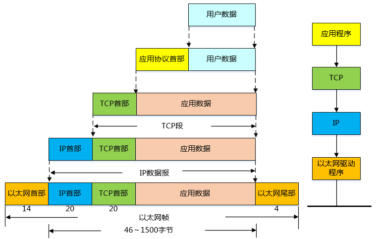
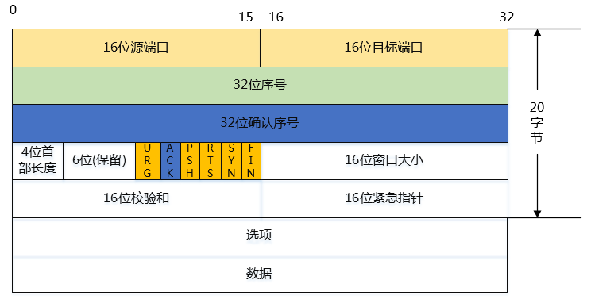
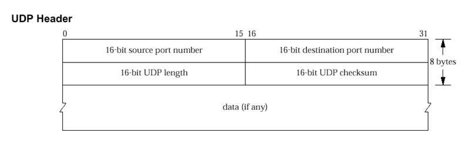
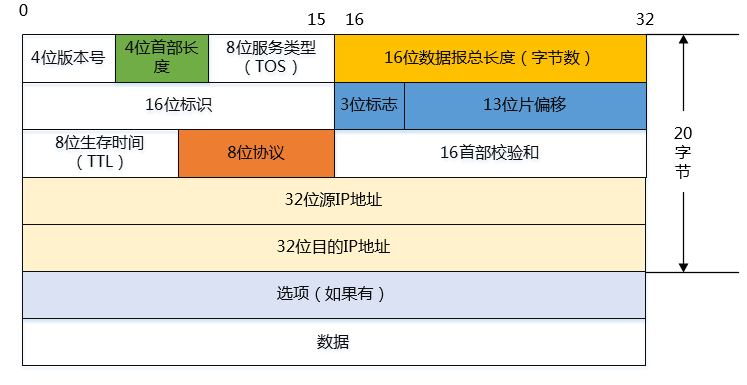
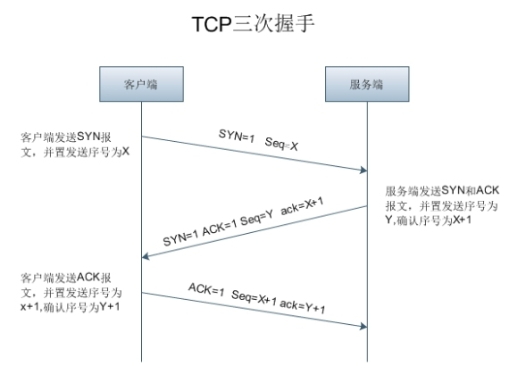
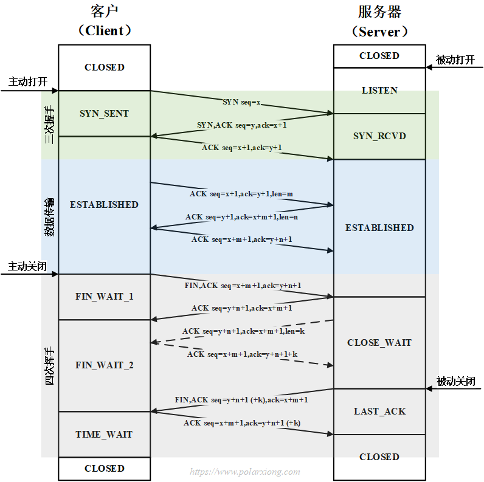
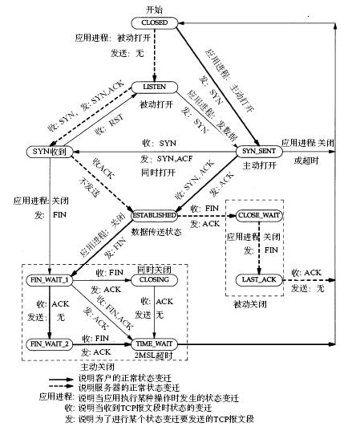
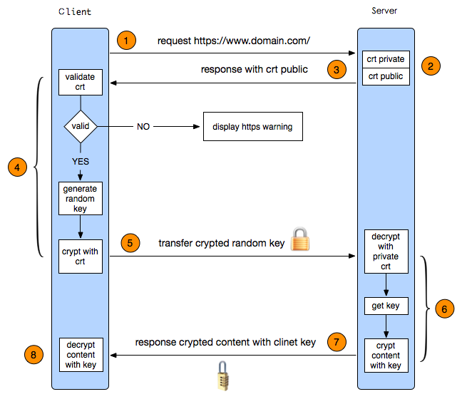

## TCP/IP

## 协议头

### TCP

### UDP

### IP

### 三次握手/四次挥手

### 状态迁移

**客户端TCP状态迁移**

CLOSED->SYN_SENT->ESTABLISHED->FIN_WAIT_1->FIN_WAIT_2->TIME_WAIT->CLOSED

**服务器TCP状态迁移**

CLOSED->LISTEN->SYN_RCVD->ESTABLISHED->CLOSE_WAIT->LAST_ACK->CLOSED

### 状态描述
1. 客户端独有的：（1）SYN_SENT （2）FIN_WAIT1 （3）FIN_WAIT2 （4）CLOSING （5）TIME_WAIT 。

2. 服务器独有的：（1）LISTEN （2）SYN_RCVD （3）CLOSE_WAIT （4）LAST_ACK 。

3. 共有的：（1）CLOSED （2）ESTABLISHED 。

### 状态含义
* LISTEN - 侦听来自远方TCP端口的连接请求；
* SYN-SENT -在发送连接请求后等待匹配的连接请求；
* SYN-RECEIVED - 在收到和发送一个连接请求后等待对连接请求的确认；
* ESTABLISHED- 代表一个打开的连接，数据可以传送给用户；
* FIN-WAIT-1 - 等待远程TCP的连接中断请求，或先前的连接中断请求的确认；
* FIN-WAIT-2 - 从远程TCP等待连接中断请求；
* CLOSE-WAIT - 等待从本地用户发来的连接中断请求；
* CLOSING -等待远程TCP对连接中断的确认；
* LAST-ACK - 等待原来发向远程TCP的连接中断请求的确认；
* TIME-WAIT -等待足够的时间以确保远程TCP接收到连接中断请求的确认；
* CLOSED - 没有任何连接状态；

### 状态详解
1. LISTENING ：侦听来自远方的TCP端口的连接请求\
    * 首先服务端需要打开一个 socket 进行监听，状态为LISTEN。
    * 有提供某种服务才会处于LISTENING状态， TCP状态变化就是某个端口的状态变化，提供一个服务就打开一个端口，例如：提供www服务默认开的是80端口，提供ftp服务默认的端口为21，当提供的服务没有被连接时就处于LISTENING状态。FTP服务启动后首先处于侦听(LISTENING)状态。处于侦听LISTENING状态时，该端口是开放的，等待连接，但还没有被连接。就像你房子的门已经敞开的，但还没有人进来。\
    * 看LISTENING状态最主要的是看本机开了哪些端口，这些端口都是哪个程序开的，关闭不必要的端口是保证安全的一个非常重要的方面，服务端口都对应一个服务(应用程序)，停止该服务就关闭了该端口，例如要关闭21端口只要停止IIS服务中的FTP服务即可。关于这方面的知识请参阅其它文章。\
    * 如果你不幸中了服务端口的木马，木马也开个端口处于LISTENING状态。

2. SYN-SENT： 客户端SYN_SENT状态
    * 在客户端发送连接请求后，等待匹配的连接请求:
    * 客户端通过应用程序调用connect进行active open.于是客户端tcp发送一个SYN以请求建立一个连接.之后状态置为SYN_SENT. /*The socket is actively attempting to establish a connection. 在发送连接请求后等待匹配的连接请求 */

    * 当请求连接时客户端首先要发送同步信号给要访问的机器，此时状态为SYN_SENT，如果连接成功了就变为ESTABLISHED，正常情况下SYN_SENT状态非常短暂。例如要访问网站http://www.baidu.com,如果是正常连接的话，用TCPView观察 IEXPLORE .EXE(IE)建立的连接会发现很快从SYN_SENT变为ESTABLISHED，表示连接成功。SYN_SENT状态快的也许看不到。

    * 如果发现有很多SYN_SENT出现，那一般有这么几种情况，一是你要访问的网站不存在或线路不好，二是用扫描软件扫描一个网段的机器，也会出出现很多SYN_SENT，另外就是可能中了病毒了，例如中了"冲击波"，病毒发作时会扫描其它机器，这样会有很多SYN_SENT出现。

3. SYN-RECEIVED： 服务器端状态SYN_RCVD
    * 再收到和发送一个连接请求后等待对方对连接请求的确认。当服务器收到客户端发送的同步信号时，将标志位ACK和SYN置1发送给客户端，此时服务器端处于SYN_RCVD状态，如果连接成功了就变为ESTABLISHED，正常情况下SYN_RCVD状态非常短暂。如果发现有很多SYN_RCVD状态，那你的机器有可能被SYN Flood的DoS(拒绝服务攻击)攻击了。
    * SYN Flood的攻击原理是：\
    在进行三次握手时，攻击软件向被攻击的服务器发送SYN连接请求(握手的第一步)，但是这个地址是伪造的，如攻击软件随机伪造了51.133.163.104、65.158.99.152等等地址。 服务器 在收到连接请求时将标志位 ACK和 SYN 置1发送给客户端(握手的第二步)，但是这些客户端的IP地址都是伪造的，服务器根本找不到客户机，也就是说握手的第三步不可能完成。\
    这种情况下服务器端一般会重试(再次发送SYN+ACK给客户端)并等待一段时间后丢弃这个未完成的连接，这段时间的长度我们称为SYN Timeout，一般来说这个时间是分钟的数量级(大约为30秒-2分钟);一个用户出现异常导致服务器的一个线程等待1分钟并不是什么很大的问题，但如果有一个恶意的攻击者大量模拟这种情况，服务器端将为了维护一个非常大的半连接列表而消耗非常多的资源----数以万计的半连接，即使是简单的保存并遍历也会消耗非常多的 CPU 时间和内存，何况还要不断对这个列表中的IP进行SYN+ACK的重试。此时从正常客户的角度看来，服务器失去响应，这种情况我们称做： 服务器端受到了SYN Flood攻击(SYN洪水攻击 )

* ESTABLISHED：代表一个打开的连接。
    * ESTABLISHED状态是表示两台机器正在传输数据，观察这个状态最主要的就是看哪个程序正在处于ESTABLISHED状态。
    * 服务器出现很多 ESTABLISHED状态： netstat -nat |grep 9502或者使用lsof -i:9502可以检测到。
    * 当客户端未主动close的时候就断开连接：即客户端发送的FIN丢失或未发送。
    * 这时候若客户端断开的时候发送了FIN包，则服务端将会处于CLOSE_WAIT状态;
    * 这时候若客户端断开的时候未发送FIN包，则服务端处还是显示ESTABLISHED状态;
    * 结果客户端重新连接服务器。
    * 而新连接上来的客户端(也就是刚才断掉的重新连上来了)在服务端肯定是ESTABLISHED; 如果客户端重复的上演这种情况，那么服务端将会出现大量的假的ESTABLISHED连接和CLOSE_WAIT连接。
    * 最终结果就是新的其他客户端无法连接上来，但是利用netstat还是能看到一条连接已经建立，并显示ESTABLISHED，但始终无法进入程序代码。

* FIN-WAIT-1： 等待远程TCP连接中断请求，或先前的连接中断请求的确认
    * 主动关闭(active close)端应用程序调用close，于是其TCP发出FIN请求主动关闭连接，之后进入FIN_WAIT1状态./* The socket is closed, and the connection is shutting down. 等待远程TCP的连接中断请求，或先前的连接中断请求的确认 */

* FIN-WAIT-2：从远程TCP等待连接中断请求
    * 主动关闭端接到ACK后，就进入了FIN-WAIT-2 ./* Connection is closed, and the socket is waiting for a shutdown from the remote end. 从远程TCP等待连接中断请求 */

    * 这就是著名的半关闭的状态了，这是在关闭连接时，客户端和服务器两次握手之后的状态。在这个状态下，应用程序还有接受数据的能力，但是已经无法发送数据，但是也有一种可能是，客户端一直处于FIN_WAIT_2状态，而服务器则一直处于WAIT_CLOSE状态，而直到应用层来决定关闭这个状态。

* CLOSE-WAIT：等待从本地用户发来的连接中断请求
    * 被动关闭(passive close)端TCP接到FIN后，就发出ACK以回应FIN请求(它的接收也作为文件结束符传递给上层应用程序),并进入CLOSE_WAIT. /* The remote end has shut down, waiting for the socket to close. 等待从本地用户发来的连接中断请求 */

* CLOSING：等待远程TCP对连接中断的确认
    * 比较少见./* Both sockets are shut down but we still don't have all our data sent. 等待远程TCP对连接中断的确认 */

* LAST-ACK：等待原来的发向远程TCP的连接中断请求的确认
    * 被动关闭端一段时间后，接收到文件结束符的应用程序将调用CLOSE关闭连接。这导致它的TCP也发送一个 FIN,等待对方的ACK.就进入了LAST-ACK . /* The remote end has shut down, and the socket is closed. Waiting for acknowledgement. 等待原来发向远程TCP的连接中断请求的确认 */

* TIME-WAIT：等待足够的时间以确保远程TCP接收到连接中断请求的确认
    * 在主动关闭端接收到FIN后，TCP就发送ACK包，并进入TIME-WAIT状态。/* The socket is waiting after close to handle packets still in the network.等待足够的时间以确保远程TCP接收到连接中断请求的确认 */

    * TIME_WAIT等待状态，这个状态又叫做2MSL状态，说的是在TIME_WAIT2发送了最后一个ACK数据报以后，要进入TIME_WAIT状态，这个状态是防止最后一次握手的数据报没有传送到对方那里而准备的(注意这不是四次握手，这是第四次握手的保险状态)。这个状态在很大程度上保证了双方都可以正常结束，但是，问题也来了。

    * 由于插口的2MSL状态(插口是IP和端口对的意思，socket)，使得应用程序在2MSL时间内是无法再次使用同一个插口的，对于客户程序还好一些，但是对于服务程序，例如httpd，它总是要使用同一个端口来进行服务，而在2MSL时间内，启动httpd就会出现错误(插口被使用)。为了避免这个错误，服务器给出了一个平静时间的概念，这是说在2MSL时间内，虽然可以重新启动服务器，但是这个服务器还是要平静的等待2MSL时间的过去才能进行下一次连接。

* CLOSED：没有任何连接状态
    * 被动关闭端在接受到ACK包后，就进入了closed的状态。连接结束./* The socket is not being used. 没有任何连接状态 */

### 问题分析
**TIME_WAIT、CLOSE_WAIT**
1. CLOSE_WAIT

导致 CLOSE_WAIT 大量存在的原因：就是在对方关闭连接之后服务器程序自己没有进一步发出 ACK 信号。换句话说，就是在对方连接关闭之后，程序里没有检测到，或者程序压根就忘记了这个时候需要关闭连接，于是这个资源就一直被程序占着；服务器对于程序抢占的资源没有主动回收的权利，除非终止程序运行。

解决方案：代码需要判断 socket ，一旦读到 0，断开连接，read 返回负，检查一下 errno，如果不是 AGAIN，就断开连接。
所以解决 CLOSE_WAIT 大量存在的方法还是从自身的代码出发。

2. TIME_WAIT

TIME_WAIT是主动关闭连接的一方保持的状态，对于服务器来说它本身就是“客户端”，在完成一个爬取任务之后，它就会发起主动关闭连接，从而进入TIME_WAIT的状态，然后在保持这个状态2MSL（max segment lifetime）时间之后，彻底关闭回收资源。这个是 TCP/IP 的设计者规定的，主要出于以下两个方面的考虑：

* 防止上一次连接中的包，迷路后重新出现，影响新连接（经过2MSL，上一次连接中所有的重复包都会消失）
* 可靠的关闭TCP连接。在主动关闭方发送的最后一个 ACK(FIN) ，有可能丢失，这时被动方会重新发 FIN，如果这时主动方处于 CLOSED 状态，就会响应 RST 而不是 ACK；所以主动方要处于 TIME_WAIT 状态，而不能是 CLOSED。另外这么设计 TIME_WAIT 会定时的回收资源，并不会占用很大资源的，除非短时间内接受大量请求或者受到攻击。

### 建立一个 socket 连接要经过哪些步骤

## 浏览器打开一个链接的过程

## HTTP

### http的method

### get、post、head的区别

### http的长连接

### https的加密方式和流程
HTTPS 中的 SSL 握手建立过程，假设现在有客户端 A 和服务器 B ：
1. 首先，客户端 A 访问服务器 B ，比如我们用浏览器打开一个网页 https://www.baidu.com ，这时，浏览器就是客户端 A ，百度的服务器就是服务器 B 了。这时候客户端 A 会生成一个随机数1，把随机数1 、自己支持的 SSL 版本号以及加密算法等这些信息告诉服务器 B 。
服务器 B 知道这些信息后，然后确认一下双方的加密算法，然后服务端也生成一个随机数 B ，并将随机数 B 和 CA 颁发给自己的证书一同返回给客户端 A 。
2. 客户端 A 得到 CA 证书后，会去校验该 CA 证书的有效性，校验方法在上面已经说过了。校验通过后，客户端生成一个随机数3 ，然后用证书中的公钥加密随机数3 并传输给服务端 B 。
3. 服务端 B 得到加密后的随机数3，然后利用私钥进行解密，得到真正的随机数3。
4. 最后，客户端 A 和服务端 B 都有随机数1、随机数2、随机数3，然后双方利用这三个随机数生成一个对话密钥。之后传输内容就是利用对话密钥来进行加解密了。这时就是利用了对称加密，一般用的都是 AES 算法。
5. 客户端 A 通知服务端 B ，指明后面的通讯用对话密钥来完成，同时通知服务器 B 客户端 A 的握手过程结束。
6. 服务端 B 通知客户端 A，指明后面的通讯用对话密钥来完成，同时通知客户端 A 服务器 B 的握手过程结束。
7. SSL 的握手部分结束，SSL 安全通道的数据通讯开始，客户端 A 和服务器 B 开始使用相同的对话密钥进行数据通讯。
8. 到此，SSL 握手过程就讲完了。

简单地来讲：
1. 客户端和服务端建立 SSL 握手，客户端通过 CA 证书来确认服务端的身份；
2. 互相传递三个随机数，之后通过这随机数来生成一个密钥；
3. 互相确认密钥，然后握手结束；
4. 数据通讯开始，都使用同一个对话密钥来加解密；

可以发现，在 HTTPS 加密原理的过程中把对称加密和非对称加密都利用了起来。即利用了非对称加密安全性高的特点，又利用了对称加密速度快，效率高的好处。

### http和https三次握手的区别

https握手：
1. 客户端发起HTTPS请求

2. 服务端的配置

采用HTTPS协议的服务器必须要有一套数字证书，可以是自己制作或者CA证书。区别就是自己颁发的证书需要客户端验证通过，才可以继续访问，而使用CA证书则不会弹出提示页面。这套证书其实就是一对公钥和私钥。公钥给别人加密使用，私钥给自己解密使用。

3. 传送证书

这个证书其实就是公钥，只是包含了很多信息，如证书的颁发机构，过期时间等。

4. 客户端解析证书

这部分工作是有客户端的TLS来完成的，首先会验证公钥是否有效，比如颁发机构，过期时间等，如果发现异常，则会弹出一个警告框，提示证书存在问题。如果证书没有问题，那么就生成一个随即值，然后用证书对该随机值进行加密。

5. 传送加密信息

这部分传送的是用证书加密后的随机值，目的就是让服务端得到这个随机值，以后客户端和服务端的通信就可以通过这个随机值来进行加密解密了。

6. 服务段解密信息

服务端用私钥解密后，得到了客户端传过来的随机值(私钥)，然后把内容通过该值进行对称加密。所谓对称加密就是，将信息和私钥通过某种算法混合在一起，这样除非知道私钥，不然无法获取内容，而正好客户端和服务端都知道这个私钥，所以只要加密算法够彪悍，私钥够复杂，数据就够安全。

7. 传输加密后的信息

这部分信息是服务段用私钥加密后的信息，可以在客户端被还原。

8. 客户端解密信息

客户端用之前生成的私钥解密服务段传过来的信息，于是获取了解密后的内容。

PS: 整个握手过程第三方即使监听到了数据，也束手无策。

### session和cookie的区别
1、存取方式的不同

Cookie中只能保管ASCII字符串，假如需求存取Unicode字符或者二进制数据，需求先进行编码。Cookie中也不能直接存取Java对象。若要存储略微复杂的信息，运用Cookie是比拟艰难的。

而Session中能够存取任何类型的数据，包括而不限于String、Integer、List、Map等。Session中也能够直接保管Java Bean乃至任何Java类，对象等，运用起来十分便当。能够把Session看做是一个Java容器类。

2、隐私策略的不同

Cookie存储在客户端阅读器中，对客户端是可见的，客户端的一些程序可能会窥探、复制以至修正Cookie中的内容。而Session存储在服务器上，对客户端是透明的，不存在敏感信息泄露的风险。

假如选用Cookie，比较好的方法是，敏感的信息如账号密码等尽量不要写到Cookie中。最好是像Google、Baidu那样将Cookie信息加密，提交到服务器后再进行解密，保证Cookie中的信息只要本人能读得懂。而假如选择Session就省事多了，反正是放在服务器上，Session里任何隐私都能够有效的保护。

3、有效期上的不同

使用过Google的人都晓得，假如登录过Google，则Google的登录信息长期有效。用户不用每次访问都重新登录，Google会持久地记载该用户的登录信息。要到达这种效果，运用Cookie会是比较好的选择。只需要设置Cookie的过期时间属性为一个很大很大的数字。

由于Session依赖于名为JSESSIONID的Cookie，而Cookie JSESSIONID的过期时间默许为–1，只需关闭了阅读器该Session就会失效，因而Session不能完成信息永世有效的效果。运用URL地址重写也不能完成。而且假如设置Session的超时时间过长，服务器累计的Session就会越多，越容易招致内存溢出。

4、服务器压力的不同

Session是保管在服务器端的，每个用户都会产生一个Session。假如并发访问的用户十分多，会产生十分多的Session，耗费大量的内存。因而像Google、Baidu、Sina这样并发访问量极高的网站，是不太可能运用Session来追踪客户会话的。

而Cookie保管在客户端，不占用服务器资源。假如并发阅读的用户十分多，Cookie是很好的选择。关于Google、Baidu、Sina来说，Cookie或许是唯一的选择。

5、浏览器支持的不同

Cookie是需要客户端浏览器支持的。假如客户端禁用了Cookie，或者不支持Cookie，则会话跟踪会失效。关于WAP上的应用，常规的Cookie就派不上用场了。

假如客户端浏览器不支持Cookie，需要运用Session以及URL地址重写。需要注意的是一切的用到Session程序的URL都要进行URL地址重写，否则Session会话跟踪还会失效。关于WAP应用来说，Session+URL地址重写或许是它唯一的选择。

假如客户端支持Cookie，则Cookie既能够设为本浏览器窗口以及子窗口内有效（把过期时间设为–1），也能够设为一切阅读器窗口内有效（把过期时间设为某个大于0的整数）。但Session只能在本阅读器窗口以及其子窗口内有效。假如两个浏览器窗口互不相干，它们将运用两个不同的Session。（IE8下不同窗口Session相干）

6、跨域支持上的不同

Cookie支持跨域名访问，例如将domain属性设置为“.biaodianfu.com”，则以“.biaodianfu.com”为后缀的一切域名均能够访问该Cookie。跨域名Cookie如今被普遍用在网络中，例如Google、Baidu、Sina等。而Session则不会支持跨域名访问。Session仅在他所在的域名内有效。

仅运用Cookie或者仅运用Session可能完成不了理想的效果。这时应该尝试一下同时运用Cookie与Session。Cookie与Session的搭配运用在实践项目中会完成很多意想不到的效果。
