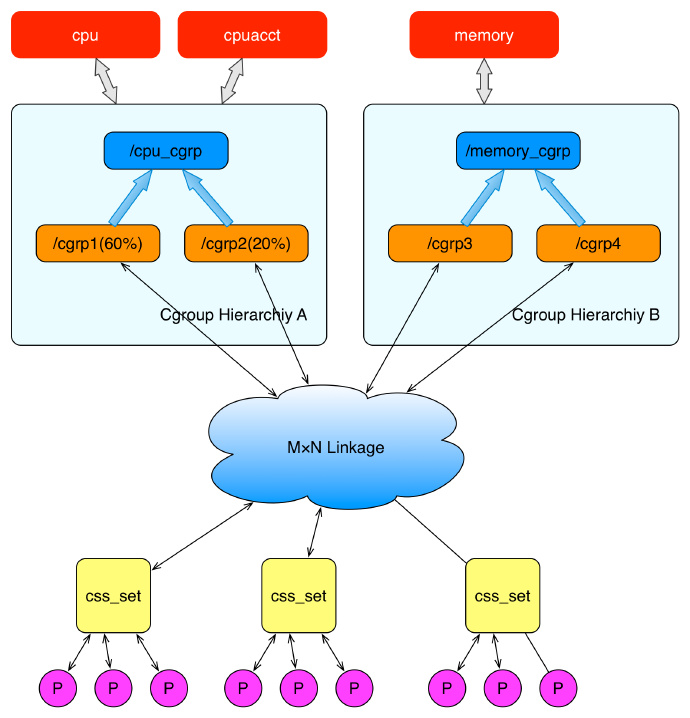
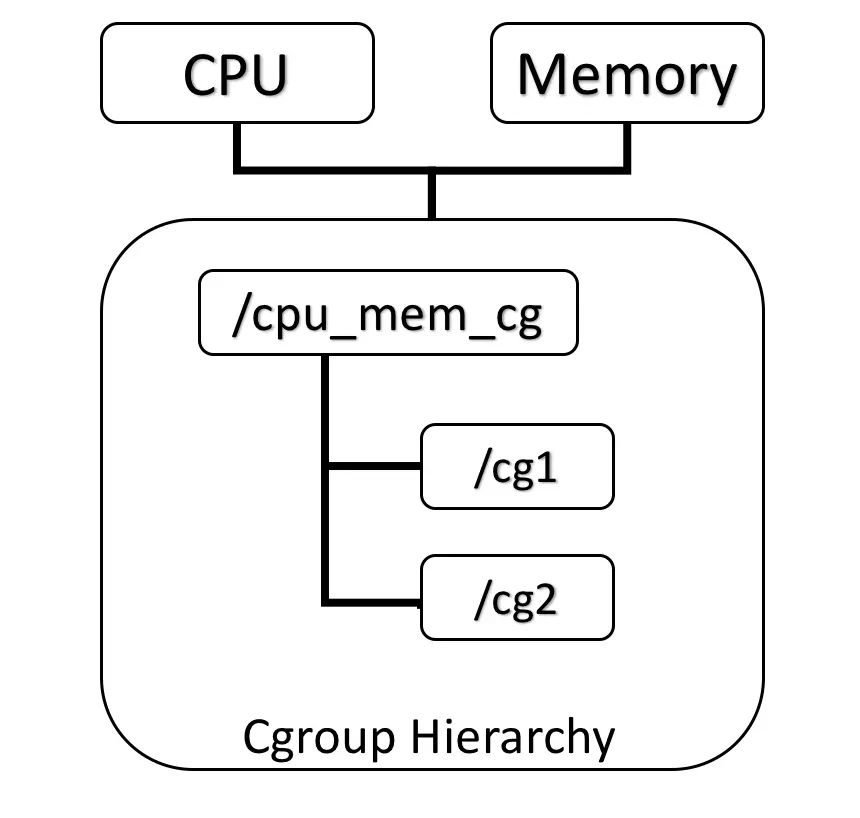
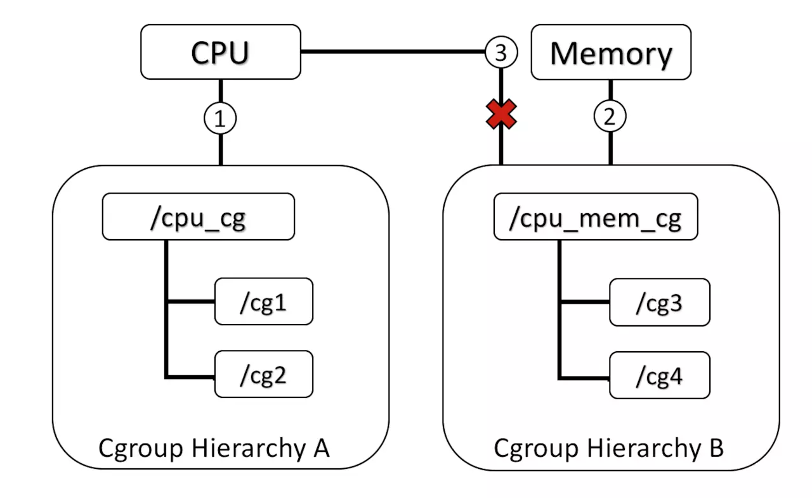
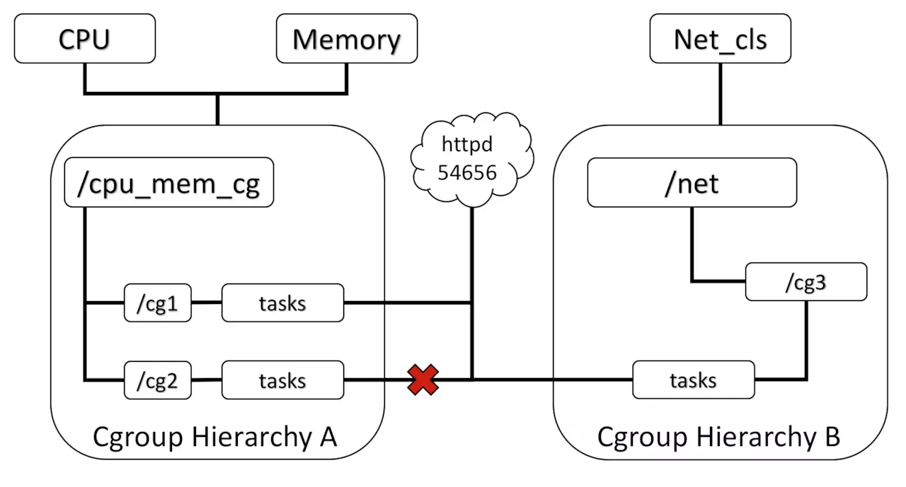
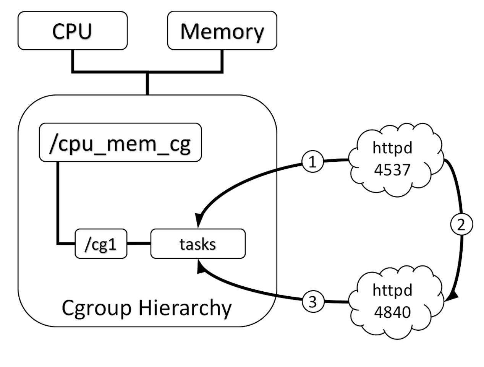

# cgroups

## cgroups的相关概念
* **task（任务）**：cgroups 的术语中，task 就表示系统的一个进程。
* **cgroup（控制组）**：cgroups 中的资源控制都以 cgroup 为单位实现。cgroup 表示按某种资源控制标准划分而成的任务组，包含一个或多个子系统。一个任务可以加入某个 cgroup，也可以从某个 cgroup 迁移到另外一个 cgroup。
* **subsystem（子系统）**：cgroups 中的 subsystem 就是一个资源调度控制器（Resource Controller）。比如 CPU 子系统可以控制 CPU 时间分配，内存子系统可以限制 cgroup 内存使用量。
* **hierarchy（层级树）**：hierarchy 由一系列 cgroup 以一个树状结构排列而成，每个 hierarchy 通过绑定对应的 subsystem 进行资源调度。hierarchy 中的 cgroup 节点可以包含零或多个子节点，子节点继承父节点的属性。整个系统可以有多个 hierarchy。

## cgroups子系统（subsystem)
子系统就是cgroups的资源控制系统，每种子系统独立地控制一种资源，目前Docker使用如下前8种子系统：

* **blkio**:块设备输入/输出限制，如物理驱动设备(包括磁盘、固态、USB等)。Linux中分为块设备和字符设备两种，块设备以块存储数据，可以进行数据的寻址；字符设备提供连续的数据流，按字节/字符读取，如键盘、串口等。
* **cpu**: 使用调度程序控制任务对cpu的使用
* **cpuacct**：自动生成cgroup中任务对CPU资源使用情况的报告
* **cpuset**: 可以为cgroup中任务数分配独立的cpu(针对多处理器)
* **devices**: 可以开启或关闭对设备的访问，也就是黑名单和白名单的作用
* **freezer**: 挂起或恢复cgroup中的任务
* **memory**: 可以设定cgroup中任务对内存使用量的限定，并自动生成内存使用情况报告
* **perf_event**: 对cgroup中的任务可以进行统一的性能测试
* **net_cls**: 这个 subsystem Docker 没有直接使用，它通过使用等级识别符 (classid) 标记网络数据包，从而允许 Linux 流量控制程序（TC：Traffic Controller）识别从具体 cgroup 中生成的数据包。
* **net_prio**： 网络报文优先级；net_prio（Network Priority）子资源能够动态设置 cgroup 中应用在网络接口的优先级。网络优先级是报文的一个属性值，tc可以设置网络的优先级，socket 也可以通过 SO_PRIORITY 选项设置它（但是很少应用会这么做）。
* **hugetlb**： 这个子系统主要针对于HugeTLB系统进行限制，这是一个大页文件系统。
* **pids**： 这个子系统，可以实现对某个控制组中进程和线程的总数进行限制
* **rdma**： [rdma](https://www.kernel.org/doc/Documentation/cgroup-v1/rdma.txt)

## cgroups的组织结构
cgroup是一个树状结构，但系统中多个cgroup构成的并非一个单根结构，而是可以存在多个，最终构成了一个**cgroup森林**。这样做的目的是，如果只有一个层级，则所有的任务都将被迫绑定其上的所有子系统，这会给某些人物带来不必要的限制。在Docker中，每个子系统独自构成一个层级，这样做非常易于管理。组织结构图如下：



上面这个图从整体结构上描述了进程与 cgroups 之间的关系。最下面的P代表一个进程。每一个进程的描述符中有一个指针指向了一个辅助数据结构css_set（cgroups subsystem set）。 指向某一个css_set的进程会被加入到当前css_set的进程链表中。一个进程只能隶属于一个css_set，一个css_set可以包含多个进程，隶属于同一css_set的进程受到同一个css_set所关联的资源限制。

上图中的”M×N Linkage”说明的是css_set通过辅助数据结构可以与 cgroups 节点进行多对多的关联。但是 cgroups 的实现不允许css_set同时关联同一个cgroups层级结构下多个节点。 这是因为 cgroups 对同一种资源不允许有多个限制配置。

一个css_set关联多个 cgroups 层级结构的节点时，表明需要对当前css_set下的进程进行多种资源的控制。而一个 cgroups 节点关联多个css_set时，表明多个css_set下的进程列表受到同一份资源的相同限制。

cgroups、任务、子系统、层级四者间的关系及其基本规则如下：

* 同一个层级可以附加一个或多个子系统
* 一个已经附加在某个层级上的子系统不能附加到其他含有别的子系统的层级上。
* 一个任务不能存在于同一个层级的不同cgroup中，但可以存在不同层级的多个cgroup中。
* 刚fork/clone出的子任务在初始状态与其父任务处于同一个cgroup，但子任务允许被移动到不同的cgroup中。

## cgroups的基本规则
1. **规则1： 同一个hierarchy可以附加一个或多个subsystem。** 如下图，cpu和memory的subsystem附加到了一个hierarchy。



2. **规则2： 一个subsystem可以附加到多个hierarchy**，当且仅当这些hierarchy只有这唯一一个subsystem。如下图，小圈中的数字表示subsystem附加的时间顺序，CPU subsystem附加到hierarchy A的同时不能再附加到hierarchy B，因为hierarchy B已经附加了memory subsystem。如果hierarchy B与hierarchy A状态相同，没有附加过memory subsystem，那么CPU subsystem同时附加到两个hierarchy是可以的。



3. **规则3： 一个 task 不能属于同一个 hierarchy 的不同 cgroup**。系统每次新建一个hierarchy时，该系统上的所有task默认构成了这个新建的hierarchy的初始化cgroup，这个cgroup也称为root cgroup。对于你创建的每个hierarchy，task只能存在于其中一个cgroup中，即一个task不能存在于同一个hierarchy的不同cgroup中，但是一个task可以存在在不同hierarchy中的多个cgroup中。如果操作时把一个task添加到同一个hierarchy中的另一个cgroup中，则会从第一个cgroup中移除。在下图中可以看到，httpd进程已经加入到hierarchy A中的/cg1而不能加入同一个hierarchy中的/cg2，但是可以加入hierarchy B中的/cg3。实际上不允许加入同一个hierarchy中的其他cgroup野生为了防止出现矛盾，如CPU subsystem为/cg1分配了30%，而为/cg2分配了50%，此时如果httpd在这两个cgroup中，就会出现矛盾。



4. **规则4： 进程（task）在fork自身时创建的子任务（child task）默认与原task在同一个cgroup中**，但是child task允许被移动到不同的cgroup中。即fork完成后，父子进程间是完全独立的。如下图中，小圈中的数字表示task 出现的时间顺序，当httpd刚fork出另一个httpd时，在同一个hierarchy中的同一个cgroup中。但是随后如果PID为4840的httpd需要移动到其他cgroup也是可以的，因为父子任务间已经独立。总结起来就是：初始化时子任务与父任务在同一个cgroup，但是这种关系随后可以改变。




## cgroups的实现方式
cgroups的实质是给任务挂上钩子，当任务运行的工程中涉及某种资源时，就会触发钩子上所附带的子系统进行检测，根据资源类别的不同，使用相应的技术进行资源限制和优先级分配。

cgroup与任务是多对多的关系，它们不直接关联，而是通过一个中间结构把双向的关联信息记录起来，类似于数据库中的中间表。任务结构体task_struct中包含了一个指针，可以查询相应的cgroup情况，同时可以查询子系统的状态，子系统状态中也包含了找到任务的指针。

一个cgroup创建完成，不管绑定了何种子系统，其目录下都会生成以下几个文件，用来描述cgroup相应信息。

* tasks： 这个文件罗列所有在该cgroup中任务的TID，即所有进程或线程的ID，并不保证有序。
* cgroup.procs: 罗列所有在该cgroup中的TGID(线程组ID)，即线程组中的一个进程的PID。不保证有序和无重复，写一个TGID到这个文件就代表把与其相关的线程加到这个cgroup中。
* notify_on_release: 填0或1，表示cgroup中最后一个任务退出时通知运行release_agent，默认不运行(0)
* release_agent：指定release_agent执行脚本的文件路径，用于自动化卸载无用的cgroup

## cgroups使用

### cgroup-tools工具
在 CentOS 7 中需要通过 yum install libcgroup libcgroup-tools 安装额外的 cgroup 工具，对系统来说，默认会挂载到 /sys/fs/cgroup/ 目录下。

```shell
# 查看系统已经存在cgroup子系统及其挂载点
lssubsys -am
# 或者通过mount查看cgroup类型的挂载点
mount -t cgroup

# 可以命令行挂载和卸载子系统，此时再次执行上述命令将看不到memory挂载点
umount /sys/fs/cgroup/memory/
# 挂载cgroup的memory子系统，其中最后的cgroup参数是在/proc/mounts中显示的名称
mount -t cgroup -o memory cgroup /sys/fs/cgroup/memory/
mount -t cgroup -o memory none /sys/fs/cgroup/memory/
```

在 CentOS 中有 /etc/cgconfig.conf 配置文件，该文件中可用来配置开机自动启动时挂载的条目：
```shell
mount {
    net_prio = /sys/fs/cgroup/net_prio;
}
```

#### 通过 libcgroup-tools 创建分组并设置资源配置参数
1. 创建控制组群

可以通过如下方式创建以及删除群组，创建后会在 cpu 挂载目录下 /sys/fs/cgroup/cpu/ 目录下看到一个新的目录 test，这个就是新创建的 cpu 子控制组群。
```shell
cgcreate -g cpu:/test
cgdelete -g cpu:/test
```

2. 设置组群参数

cpu.shares 是控制 CPU 的一个属性，更多的属性可以到 /sys/fs/cgroup/cpu 目录下查看，默认值是 1024，值越大，能获得更多的 CPU 时间。
```shell
cgset -r cpu.shares=512 test
```

3. 将进程添加到控制组群

可以直接将需要执行的命令添加到分组中。
```shell
# 直接在cgroup中执行
cgexec -g cpu:small some-program
# 将现有的进程添加到cgroup中
cgclassify -g subsystems:path_to_cgroups pidlist
```

例如，想把 sshd 添加到一个分组中，可以通过如下方式操作。
```shell
cgclassify -g cpu:/test `pidof sshd`
cat /sys/fs/cgroup/cpu/test/tasks
```
就会看到相应的进程在这个文件中。

#### CPU
在 CGroup 中，与 CPU 相关的子系统有 cpusets、cpuacct 和 cpu 。
* CPUSET 用于设置CPU、内存的亲和性，可以指定运行CPU或者不运行在某个CPU上，一般只会在一些高性能场景使用。
* CPUACCT 显示当前cgroup所用CPU的统计信息。

这里简单介绍 cpu 子系统，包括怎么限制 cgroup 的 CPU 使用上限及与其它 cgroup 的相对值。

**cpu.cfs_period_us & cpu.cfs_quota_us**

其中 cfs_period_us 用来配置时间周期长度；cfs_quota_us 用来配置当前 cgroup 在设置的周期长度内所能使用的 CPU 时间数，两个文件配合起来设置 CPU 的使用上限。

两个文件单位是微秒，cfs_period_us 的取值范围为 [1ms, 1s]，默认 100ms ；cfs_quota_us 的取值大于 1ms 即可，如果 cfs_quota_us 的值为 -1(默认值)，表示不受 cpu 时间的限制。

下面是几个例子：
```shell
# 1.限制只能使用1个CPU，每100ms能使用100ms的CPU时间
echo 100000 > cpu.cfs_quota_us
echo 100000 > cpu.cfs_period_us

# 2.限制使用2个CPU核，每100ms能使用200ms的CPU时间，即使用两个内核
echo 200000 > cpu.cfs_quota_us
echo 100000 > cpu.cfs_period_us

# 3.限制使用1个CPU的50%，每100ms能使用50ms的CPU时间，即使用一个CPU核心的50%
echo 50000 > cpu.cfs_quota_us
echo 100000 > cpu.cfs_period_us
```

**cpu.shares**
用于设置相对值，这里针对的是所有 CPU (多核)，默认是 1024，假如系统中有两个 A(1024) 和 B(512)，那么 A 将获得 1024/(1204+512)=66.67% 的 CPU 资源，而 B 将获得 33% 的 CPU 资源。

对于 shares 有两个特点：

* 如果A不忙，没有使用到66%的CPU时间，那么剩余的CPU时间将会被系统分配给B，即B的CPU使用率可以超过33%；
* 添加了一个新的C，它的shares值是1024，那么A和C的限额变为1024/(1204+512+1024)=40%，B的资源变成了20%；

也就是说，在空闲时 shares 基本上不起作用，只有在 CPU 忙的时候起作用。但是这里设置的值是需要与其它系统进行比较，而非设置了一个绝对值。

示例:演示一下如何控制CPU的使用率。
```shell
# 创建并查看当前的分组
cgcreate -g cpu:/small
ls /sys/fs/cgroup/cpu/small

# 查看当前值，默认是1024
cat /sys/fs/cgroup/cpu/small/cpu.shares
cgset -r cpu.shares=512 small

# 执行需要运行的程序，或者将正在运行程序添加到分组
cgexec -g cpu:small ./foobar
cgclassify -g cpu:small <PID>

# 设置只能使用1个cpu的20%的时间
echo 50000 > cpu.cfs_period_us
echo 10000 > cpu.cfs_quota_us

# 将当前bash加入到该cgroup
BASH_PID=`echo $$`
echo $BASH_PID > cgroup.procs

# 启动一个bash内的死循环，正常情况下应该使用100%的cpu，消耗一个核
while :; do echo test > /dev/null; done
```
注意，如果是在启动进程之后添加的，实际上 CPU 资源限制的速度会比较慢，不是立即就会限制死的，而且不是严格准确。如果起了多个子进程，那么各个进程之间的资源是共享的。

**其它**

可以通过如下命令查看进程属于哪个 cgroup 。
```shell
ps -O cgroup
cat /proc/PID/cgroup
```

#### 内存
相比来说，内存控制要简单的多，只需要注意物理内存和 SWAP 即可。
```shell
# 创建并查看当前的分组
cgcreate -g memory:/small
ls /sys/fs/cgroup/memory/small

# 查看当前值，默认是一个很大很大的值，设置为1M
cat /sys/fs/cgroup/memory/small/memory.limit_in_bytes
cgset -r memory.limit_in_bytes=10485760 small

# 如果开启了swap之后，会发现实际上内存只限制了RSS，设置时需要确保没有进程在使用
cgset -r memory.memsw.limit_in_bytes=104857600 small

# 启动测试程序
cgexec -g cpu:small -g memory:small ./foobar
cgexec -g cpu,memory:small ./foobar
```

**OOM**

当进程试图占用的内存超过了 cgroups 的限制时，会触发 out of memory 导致进程被强制 kill 掉。
```shell
# 关闭默认的OOM
echo 1 > memory.oom_control
cgset -r memory.oom_control=1 small
```
注意，及时关闭了 OOM，对应的进程会处于 uninterruptible sleep 状态。

### systemd
CentOS 7 中默认的资源隔离是通过 systemd 进行资源控制的，systemd 内部使用 cgroups 对其下的单元进行资源管理，包括 CPU、BlcokIO 以及 MEM，通过 cgroup 可以 。

systemd 的资源管理主要基于三个单元 service、scope 以及 slice：
* service，通过 unit 配置文件定义，包括了一个或者多个进程，可以作为整体启停。
* scope，任意进程可以通过 fork() 方式创建进程，常见的有 session、container 等。
* slice，按照层级对 service、scope 组织的运行单元，不单独包含进程资源，进程包含在 service 和 scope 中。

常用的 slice 有 ：
* system.slice，系统服务进程可能是开机启动或者登陆后手动启动的服务，例如crond、mysqld、nginx等服务；
* user.slice 用户登陆后的管理，一般为 session；
* machine.slice 虚机或者容器的管理。

对于 cgroup 默认相关的参数会保存在 /sys/fs/cgroup/ 目录下，当前系统支持的 subsys 可以通过 cat /proc/cgroups 或者 lssubsys 查看。

常见命令：
```shell
# 查看slice、scope、service层级关系
systemd-cgls

# 当前资源使用情况
systemd-cgtop

# 启动一个服务
systemd-run --unit=name --scope --slice=slice_name command
#   unit   用于标示，如果不使用会自动生成一个，通过systemctl会输出；
#   scope  默认使用service，该参数指定使用scope ；
#   slice  将新启动的service或者scope添加到slice中，默认添加到system.slice，也可以添加到已有slice(systemctl -t slice)或者新建一个。

systemd-run --unit=toptest --slice=test top -b
systemctl stop toptest

# 查看当前资源使用状态
systemctl show toptest
# 各服务配置保存在 /usr/lib/systemd/system/ 目录下，可以通过如下命令设置各个服务的参数。

# 会自动保存到配置文件中做持久化
systemctl set-property name parameter=value

# 只临时修改不做持久化
systemctl set-property --runtime name property=value

# 设置CPU和内存使用率
systemctl set-property httpd.service CPUShares=600 MemoryLimit=500M
```

## 参考资料
[Docker 背后的内核知识——cgroups 资源限制](https://www.infoq.cn/article/docker-kernel-knowledge-cgroups-resource-isolation) \
[容器之 CGroup](https://www.centos.bz/2018/08/%E5%AE%B9%E5%99%A8%E4%B9%8B-cgroup/) \
[docker 容器基础技术：linux cgroup 简介](https://cizixs.com/2017/08/25/linux-cgroup/) \
[cgroups资源限制](http://www.wangjialong.cc/2017/11/07/cgroups_info/) \
[Cgroups 与 Systemd](https://www.cnblogs.com/sparkdev/p/9523194.html) \
[linux namespace and cgroup](https://juejin.im/post/5a113fd851882575cb73b1a5#heading-19) \
[CGroup 介绍、应用实例及原理描述](https://www.ibm.com/developerworks/cn/linux/1506_cgroup/index.html)
