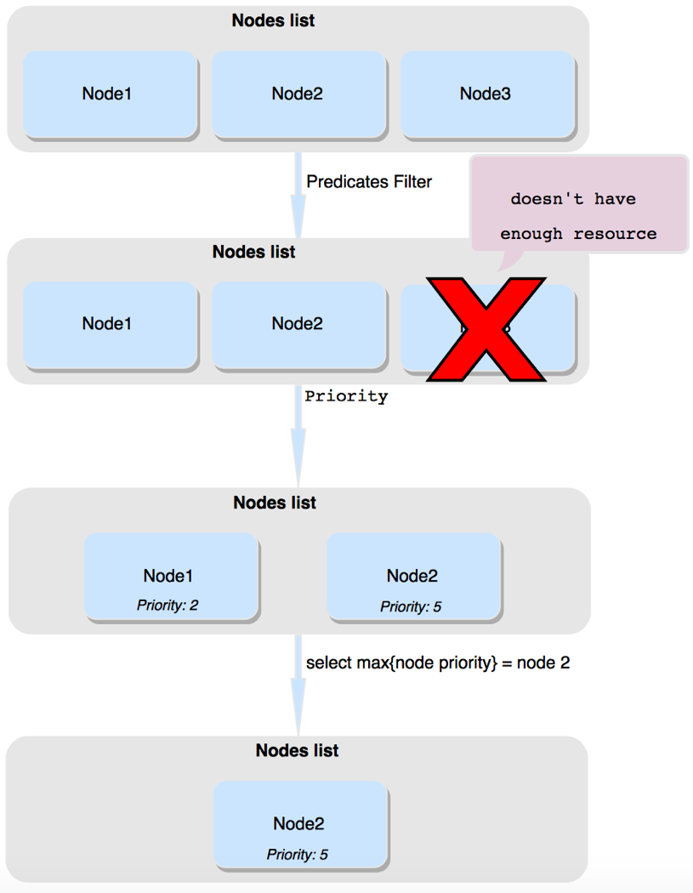
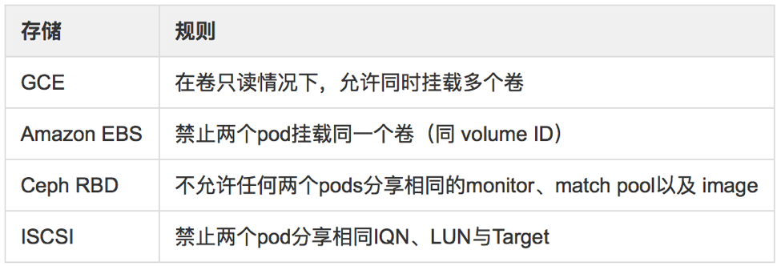
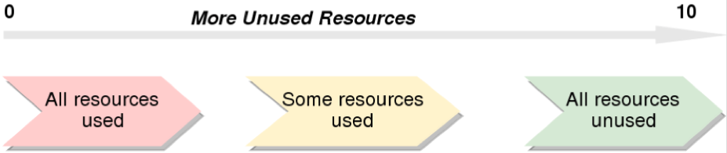
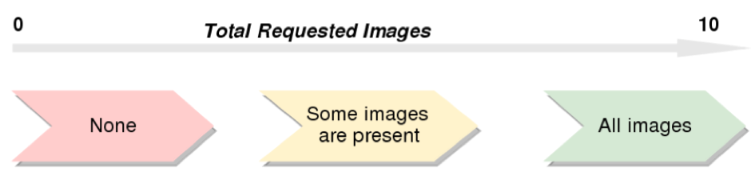
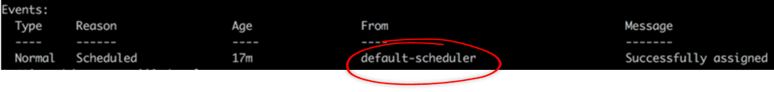
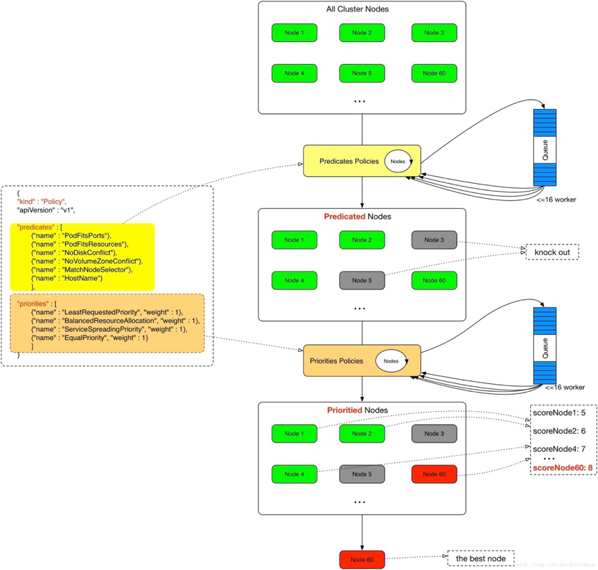

# kubernetes 调度

## 1. 简介
Kubernetes中的调度策略可以大致分为两种：
* 一种是全局的调度策略，要在启动调度器时配置，包括kubernetes调度器自带的各种predicates和priorities算法；
* 另一种是运行时调度策略，包括nodeAffinity（主机亲和性），podAffinity（POD亲和性）以及podAntiAffinity（POD反亲和性）。

## 2. 全局调度策略
Scheduler是Kubernetes的调度器，其作用是根据特定的调度算法和策略将Pod调度到指定的计算节点（Node）上，其做为单独的程序运行，启动之后会一直监听API Server，获取PodSpec.NodeName为空的Pod，对每个Pod都会创建一个绑定（binding）。

调度器是Kubernetes容器集群管理系统中加载并运行的调度程序，负责收集、统计分析容器集群管理系统中所有Node的资源使用情况，然后以此为依据将新建的Pod发送到优先级最高的可用Node上去建立。

调度分为几个部分：
1. 首先是预选过程，过滤掉不满足条件的节点，这个过程称为Predicates；
2. 然后是优选过程，对通过的节点按照优先级排序，称之为Priorities；
3. 最后从中选择优先级最高的节点。
如果中间任何一步骤有错误，就直接返回错误。

进一步说：

Predicates阶段回答“能不能”的问题：首先遍历全部节点，过滤掉不满足条件的节点，这一阶段输出的所有满足要求的Node将被记录并作为第二阶段的输入。

Priorities阶段是回答“哪个更适合的问题”：即再次对节点进行筛选，筛选出最适合运行Pod的节点。

如果在预选（Predicates）过程中，如果所有的节点都不满足条件，Pod 会一直处在Pending 状态，直到有节点满足条件，这期间调度器会不断的重试。经过节点过滤后，如多个节点满足条件，会按照节点优先级（priorities）大小对节点排序，最后选择优先级最高的节点部署Pod。

调度过程图示如下：



具体的调度过程，一般如下：
1. 首先，客户端通过API Server的REST API/kubectl/helm创建pod/service/deployment/job等，支持类型主要为JSON/YAML/helm tgz。
2. 接下来，API Server收到用户请求，存储到相关数据到etcd。
3. 调度器通过API Server查看未调度（bind）的Pod列表，循环遍历地为每个Pod分配节点，尝试为Pod分配节点。调度过程分为2个阶段：
    * 第一阶段：预选过程，过滤节点，调度器用一组规则过滤掉不符合要求的主机。比如Pod指定了所需要的资源量，那么可用资源比Pod需要的资源量少的主机会被过滤掉。
    * 第二阶段：优选过程，节点优先级打分，对第一步筛选出的符合要求的主机进行打分，在主机打分阶段，调度器会考虑一些整体优化策略，比如把容一个Replication Controller的副本分布到不同的主机上，使用最低负载的主机等。
4. 选择主机：选择打分最高的节点，进行binding操作，结果存储到etcd中。
5. 所选节点对于的kubelet根据调度结果执行Pod创建操作。

Kubernetes调度器使用Predicates和Priorites来决定一个Pod应该运行在哪一个节点上。Predicates是强制性规则，用来形容主机匹配Pod所需要的资源，如果没有任何主机满足该Predicates，则该Pod会被挂起，直到有节点能够满足调度条件。

预选（Predicates）与优选（Priorites）的策略罗列如下：


### 预选（Predicates）
下面分别对Predicates的策略进行介绍：
* **NoDiskConflict**：pod所需的卷是否和节点已存在的卷冲突。如果节点已经挂载了某个卷，其它同样使用这个卷的pod不能再调度到这个主机上。GCE、Amazon EBS与Ceph RBD的规则如下：
    
* **NoVolumeZoneConflict**：检查给定的zone限制前提下，检查如果在此主机上部署Pod是否存在卷冲突。假定一些volumes可能有zone调度约束， VolumeZonePredicate根据volumes自身需求来评估pod是否满足条件。必要条件就是任何volumes的zone-labels必须与节点上的zone-labels完全匹配。节点上可以有多个zone-labels的约束（比如一个假设的复制卷可能会允许进行区域范围内的访问）。目前，这个只对PersistentVolumeClaims支持，而且只在PersistentVolume的范围内查找标签。处理在Pod的属性中定义的volumes（即不使用PersistentVolume）有可能会变得更加困难，因为要在调度的过程中确定volume的zone，这很有可能会需要调用云提供商。
* **PodFitsResources**：检查节点是否有足够资源（例如 CPU、内存与GPU等）满足一个Pod的运行需求。调度器首先会确认节点是否有足够的资源运行Pod，如果资源不能满足Pod需求，会返回失败原因（例如，CPU/内存 不足等）。这里需要注意的是：根据实际已经分配的资源量做调度，而不是使用已实际使用的资源量做调度。
* **PodFitsHostPorts**：检查Pod容器所需的HostPort是否已被节点上其它容器或服务占用。如果所需的HostPort不满足需求，那么Pod不能调度到这个主机上。
* **HostName**：检查节点是否满足PodSpec的NodeName字段中指定节点主机名，不满足节点的全部会被过滤掉。
* **MatchNodeSelector**：检查节点标签（label）是否匹配Pod的nodeSelector属性要求。
* **MaxEBSVolumeCount**：确保已挂载的EBS存储卷不超过设置的最大值。调度器会检查直接使用以及间接使用这种类型存储的PVC。计算不同卷的总和，如果卷数目会超过设置的最大值，那么新Pod不能调度到这个节点上。 最大卷的数量可通过环境变量KUBE_MAX_PD_VOLS设置。
* **MaxGCEPDVolumeCount**：确保已挂载的GCE存储卷不超过预设的最大值。与MaxEBSVolumeCount类似，最大卷的数量同样可通过环境变量KUBE_MAX_PD_VOLS设置。
* **MaxAzureDiskVolumeCount** : 确保已挂载的Azure存储卷不超过设置的最大值。默认值是16。规则同MaxEBSVolumeCount。
* **CheckNodeMemoryPressure** : 判断节点是否已经进入到内存压力状态，如果是则只允许调度内存为0标记的Pod。检查Pod能否调度到内存有压力的节点上。如有节点存在内存压力， Guaranteed类型的Pod（例如，requests与limit均指定且值相等） 不能调度到节点上。
* **CheckNodeDiskPressure** : 判断节点是否已经进入到磁盘压力状态，如果是，则不调度新的Pod。
* **PodToleratesNodeTaints** : 根据 taints 和 toleration 的关系判断Pod是否可以调度到节点上Pod是否满足节点容忍的一些条件。
* **MatchInterPodAffinity** : 节点亲和性筛选。
* **GeneralPredicates**：包含一些基本的筛选规则，主要考虑 Kubernetes 资源是否充足，比如 CPU 和 内存 是否足够，端口是否冲突、selector 是否匹配等：
    * PodFitsResources：检查主机上的资源是否满足Pod的需求。资源的计算是根据主机上运行Pod请求的资源作为参考的，而不是以实际运行的资源数量
    * PodFitsHost：如果Pod指定了spec.NodeName，看节点的名字是否何它匹配，只有匹配的节点才能运行Pod
    * PodFitsHostPorts：检查Pod申请的主机端口是否已经被其他Pod占用，如果是，则不能调度
    * PodSelectorMatches：检查主机的标签是否满足Pod的 selector。包括NodeAffinity和nodeSelector中定义的标签。

### 优选（Priorites）
经过预选策略（Predicates）对节点过滤后，获取节点列表，再对符合需求的节点列表进行打分，最终选择Pod调度到一个分值最高的节点。Kubernetes用一组优先级函数处理每一个通过预选的节点（kubernetes/plugin/pkg/scheduler/algorithm/priorities中实现）。每一个优先级函数会返回一个0-10的分数，分数越高表示节点越优， 同时每一个函数也会对应一个表示权重的值。最终主机的得分用以下公式计算得出：

> finalScoreNode = (weight1 * priorityFunc1) + (weight2 * priorityFunc2) + … + (weightn * priorityFuncn)

目前支持优选的优先级函数包括以下几种：
* **LeastRequestedPriority**：节点的优先级就由节点空闲资源与节点总容量的比值，即由（总容量-节点上Pod的容量总和-新Pod的容量）/总容量）来决定。CPU和内存具有相同权重，资源空闲比越高的节点得分越高。需要注意的是，这个优先级函数起到了按照资源消耗来跨节点分配Pod的作用。详细的计算规则如下：

    > cpu((capacity – sum(requested)) * 10 / capacity) + memory((capacity – sum(requested)) * 10 / capacity) / 2
    

    注：10 表示非常合适，0 表示完全不合适。

    LeastRequestedPriority举例说明：例如CPU的可用资源为100，运行容器申请的资源为15，则cpu分值为8.5分，内存可用资源为100，运行容器申请资源为20，则内存分支为8分。则此评价规则在此节点的分数为(8.5 +8) / 2 = 8.25分。

* **BalancedResourceAllocation**：CPU和内存使用率越接近的节点权重越高，该策略不能单独使用，必须和LeastRequestedPriority组合使用，尽量选择在部署Pod后各项资源更均衡的机器。如果请求的资源（CPU或者内存）大于节点的capacity，那么该节点永远不会被调度到。

    BalancedResourceAllocation举例说明：该调度策略是出于平衡度的考虑，避免出现CPU，内存消耗不均匀的事情。例如某节点的CPU剩余资源还比较充裕，假如为100，申请10，则cpuFraction为0.1，而内存剩余资源不多，假如为20，申请10，则memoryFraction为0.5，这样由于CPU和内存使用不均衡，此节点的得分为10-abs ( 0.1 - 0.5 ) * 10 = 6 分。假如CPU和内存资源比较均衡，例如两者都为0.5，那么代入公式，则得分为10分。

* **InterPodAffinityPriority**：通过迭代 weightedPodAffinityTerm 的元素计算和，并且如果对该节点满足相应的PodAffinityTerm，则将 “weight” 加到和中，具有最高和的节点是最优选的。

* **SelectorSpreadPriority**：为了更好的容灾，对同属于一个service、replication controller或者replica的多个Pod副本，尽量调度到多个不同的节点上。如果指定了区域，调度器则会尽量把Pod分散在不同区域的不同节点上。当一个Pod的被调度时，会先查找Pod对于的service或者replication controller，然后查找service或replication controller中已存在的Pod，运行Pod越少的节点的得分越高。

    SelectorSpreadPriority举例说明：这里主要针对多实例的情况下使用。例如，某一个服务，可能存在5个实例，例如当前节点已经分配了2个实例了，则本节点的得分为10*（（5-2）/ 5）=6分，而没有分配实例的节点，则得分为10 * （（5-0） / 5）=10分。没有分配实例的节点得分越高。

* **NodeAffinityPriority**：Kubernetes调度中的亲和性机制。Node Selectors（调度时将pod限定在指定节点上），支持多种操作符（In, NotIn, Exists, DoesNotExist, Gt, Lt），而不限于对节点labels的精确匹配。另外，Kubernetes支持两种类型的选择器:
    * 一种是“hard（requiredDuringSchedulingIgnoredDuringExecution）”选择器，它保证所选的主机必须满足所有Pod对主机的规则要求。这种选择器更像是之前的nodeselector，在nodeselector的基础上增加了更合适的表现语法。
    * 另一种是“soft（preferresDuringSchedulingIgnoredDuringExecution）”选择器，它作为对调度器的提示，调度器会尽量但不保证满足NodeSelector的所有要求。

* **NodePreferAvoidPodsPriority（权重1W）**：如果 节点的 Anotation 没有设置 key-value:scheduler. alpha.kubernetes.io/ preferAvoidPods = "..."，则节点对该 policy 的得分就是10分，加上权重10000，那么该node对该policy的得分至少10W分。如果Node的Anotation设置了，scheduler.alpha.kubernetes.io/preferAvoidPods = "..." ，如果该 pod 对应的 Controller 是 ReplicationController 或 ReplicaSet，则该 node 对该 policy 的得分就是0分。

* **TaintTolerationPriority**: 使用 Pod 中 tolerationList 与 节点 Taint 进行匹配，配对成功的项越多，则得分越低。

另外在优选的调度规则中，有几个未被默认使用的规则：
* **ImageLocalityPriority**：根据Node上是否存在一个pod的容器运行所需镜像大小对优先级打分，分值为0-10。遍历全部Node，如果某个Node上pod容器所需的镜像一个都不存在，分值为0；如果Node上存在Pod容器部分所需镜像，则根据这些镜像的大小来决定分值，镜像越大，分值就越高；如果Node上存在pod所需全部镜像，分值为10。


    注：10 表示非常合适，0 表示完全不合适。

* **EqualPriority**: EqualPriority 是一个优先级函数，它给予所有节点相等权重。

* **MostRequestedPriority**: 在 ClusterAutoscalerProvider 中，替换 LeastRequestedPriority，给使用多资源的节点，更高的优先级。计算公式为：(cpu(10 sum(requested) / capacity) + memory(10 sum(requested) / capacity)) / 2

### 自定义调度
使用kube-schduler的默认调度就能满足大部分需求。在默认情况下，Kubernetes调度器可以满足绝大多数需求，例如调度Pod到资源充足的节点上运行，或调度Pod分散到不同节点使集群节点资源均衡等。前面已经提到，kubernetes的调度器以插件化的形式实现的， 方便用户对调度的定制与二次开发。下面介绍几种方式：

#### 方式一：定制预选（Predicates） 和优选（Priority）策略
kube-scheduler在启动的时候可以通过 --policy-config-file参数可以指定调度策略文件，用户可以根据需要组装Predicates和Priority函数。选择不同的过滤函数和优先级函数、控制优先级函数的权重、调整过滤函数的顺序都会影响调度过程。

考官方给出的Policy文件实例：
```yaml
"kind" : "Policy",
"apiVersion" : "v1",
"predicates" : [
    {"name" : "PodFitsHostPorts"},
    {"name" : "PodFitsResources"},
    {"name" : "NoDiskConflict"},
    {"name" : "NoVolumeZoneConflict"},
    {"name" : "MatchNodeSelector"},
    {"name" : "HostName"}
    ],
"priorities" : [
    {"name" : "LeastRequestedPriority", "weight" : 1},
    {"name" : "BalancedResourceAllocation", "weight" : 1},
    {"name" : "ServiceSpreadingPriority", "weight" : 1},
    {"name" : "EqualPriority", "weight" : 1}
    ],
"hardPodAffinitySymmetricWeight" : 10
```

#### 方式二：自定义Priority和Predicate
上面的方式一是对已有的调度模块进行组合，Kubernetes还允许用户编写自己的Priority 和 Predicate函数。

过滤函数的接口：
```go
// FitPredicate is a function that indicates if a pod fits into an existing node.
// The failure information is given by the error.
type FitPredicate func(pod *v1.Pod, meta PredicateMetadata, nodeInfo *schedulercache.NodeInfo) (bool, []PredicateFailureReason, error)
```

自定义Predicates函数步骤如下：
* 在plugin/pkg/scheduler/algorithm/predicates/predicates.go文件中编写对象实现上面接口。
* 编写完过滤函数之后进行注册，让 kube-scheduler 启动的时候知道它的存在，注册部分可以在 plugin/pkg/scheduler/algorithmprovider/defaults/defaults.go 完成，可以参考其他过滤函数（例如PodFitsHostPorts）的注册代码：kubernetes/plugin/pkg/scheduler/algorithmprovider/defaults/defaults.go factory.RegisterFitPredicate("PodFitsPorts", predicates.PodFitsHostPorts)。
* 在 --policy-config-file把自定义过滤函数写进去，kube-scheduler运行时可以执行自定义调度逻辑了。
* 自定义优先级函数，实现过程和过滤函数类似。

方式三：编写自己的调度器
除了上面2种方式外，Kubernetes也允许用户编写自己的调度器组件，并在创建资源的时候引用它。多个调度器可以同时运行和工作，只要名字不冲突。

使用某个调度器就是在Pod的spec.schedulername字段中填写上调度器的名字。Kubernetes提供的调度器名字是default，如果自定义的调度器名字是my-scheduler，那么只有当spec.schedulername字段是my-scheduler才会被调度。

调度器最核心的逻辑并不复杂。Scheduler首先监听apiserver ，获取没有被调度的Pod和全部节点列表，而后根据一定的算法和策略从节点中选择一个作为调度结果，最后向apiserver中写入binding 。比如下面就是用bash编写的简单调度器：
```bash
#!/bin/bash
SERVER='localhost:8001'
while true;
do
for PODNAME in $(kubectl --server $SERVER get pods -o json | jq '.items[] | select(.spec.schedulerName == "my-scheduler") | select(.spec.nodeName == null) | .metadata.name' | tr -d '"')
;
do
    NODES=($(kubectl --server $SERVER get nodes -o json | jq '.items[].metadata.name' | tr -d '"'))
    NUMNODES=${#NODES[@]}
    CHOSEN=${NODES[$[ $RANDOM % $NUMNODES ]]}
    curl --header "Content-Type:application/json" --request POST --data '{"apiVersion":"v1", "kind": "Binding", "metadata": {"name": "'$PODNAME'"}, "target": {"apiVersion": "v1", "kind"
: "Node", "name": "'$CHOSEN'"}}' http://$SERVER/api/v1/namespaces/default/pods/$PODNAME/binding/
    echo "Assigned $PODNAME to $CHOSEN"
done
sleep 1
done
```

它通过kubectl命令从apiserver获取未调度的Pod（spec.schedulerName 是my-scheduler，并且spec.nodeName 为空），同样地，用kubectl从apiserver获取nodes的信息，然后随机选择一个node作为调度结果，并写入到apiserver中。

当然要想编写一个生产级别的调度器，要完善的东西还很多，比如：
调度过程中需要保证Pod是最新的，这个例子中每次调度 pod 的时候，它在 apiserver 中的内容可能已经发生了变化
调度过程需要考虑资源等因素（节点的资源利用率，存储和网络的信息等）
尽量提高调度的性能（使用并发来提高调度的性能）

可通过kubectl describe pod pod_name查看一个Pod采用的调度器，例如：


### Pod优先级（Priority）和抢占（Preemption）
#### Pod优先级（Priority）
Pod优先级（Priority）和抢占（Preemption）是Kubernetes 1.8版本引入的功能。

与前面所讲的调度优选策略中的优先级（Priorities）不同，前文所讲的优先级指的是节点优先级，而pod priority指的是Pod的优先级，高优先级的Pod会优先被调度，或者在资源不足低情况牺牲低优先级的Pod，以便于重要的Pod能够得到资源部署。

为了定义Pod优先级，需要先定义PriorityClass对象，该对象没有Namespace限制，官网示例：
```yaml
apiVersion: scheduling.k8s.io/v1alpha1
kind: PriorityClass
metadata:
name: high-priority
value: 1000000
globalDefault: false
description: "This priority class should be used for XYZ service pods only."
```
然后通过在Pod的spec. priorityClassName中指定已定义的PriorityClass名称即可：
```yaml
apiVersion: v1
kind: Pod
metadata:
name: nginx
labels:
env: test
spec:
containers:
- name: nginx
image: nginx
imagePullPolicy: IfNotPresent
priorityClassName: high-priority
```

#### 抢占（Preemption）
当节点没有足够的资源供调度器调度Pod、导致Pod处于pending时，抢占（preemption）逻辑会被触发。Preemption会尝试从一个节点删除低优先级的Pod，从而释放资源使高优先级的Pod得到节点资源进行部署。

Pod优先级（Priority）和抢占（preemption）具体介绍可参见https://kubernetes.io/docs/concepts/configuration/pod-priority-preemption/。

回过头来，再重新看一下Pod的调度过程。如下图示例：


## 3. 运行时调度策略

运行时调度策略主要包括以下几种：
* 选择节点（nodeSelector）
* 节点亲和性（nodeAffinity）
* pod亲和与反亲和性（podAffinity与podAntiAffinity）
* 污点(Taints）与容忍（tolerations）等

### 设置节点标签-label
Label是Kubernetes核心概念之一，其以key/value的形式附加到各种对象上，如Pod、Service、Deployment、Node等，达到识别这些对象，管理关联关系等目的，如Node和Pod的关联。

获取当前集群中的全部节点:
```shell
kubectl get nodes
```
为指定节点设置label:
```shell
kubectl label nodes <node-name> <label-key>=<label-value>
```
确认节点label是否设置成功:
```shell
kubectl get nodes -l ‘label_key=label_value’
```

### 选择节点-nodeSelector
nodeSelector是目前最为简单的一种pod运行时调度限制。**Pod.spec.nodeSelector** 通过kubernetes的label-selector机制选择节点，由调度器调度策略匹配label，而后调度pod到目标节点，该匹配规则属于强制约束。后文要讲的nodeAffinity具备nodeSelector的全部功能，所以未来Kubernetes会将nodeSelector废除。

nodeSelector举例：

1. 设置label
```shell
$ kubectl label nodes mode.dev disktype=ssd node "mode.dev" labeled
```

2. 查看满足非master节点且disktype类型为ssd的节点：
```shell
$ kubectl get nodes -l 'role!=master, disktype=ssd'
NAME                           STATUS    AGE        VERSION
mode.dev   Ready     39d        v1.7.1
```

3. pod.yaml文件内容：
```yaml
apiVersion: v1
kind: Pod
metadata:
  name: nginx
labels:
  env: test
spec:
  containers:
  - name: nginx
    image: nginx
    imagePullPolicy: IfNotPresent
    nodeSelector:
    disktype: ssd
```

4. 创建pod：
```shell
kubectl create -f pod.yaml
```

5. 查看pod nginx被调度到预期节点运行：
```shell
$ kubectl get po nginx -o wide
NAME      READY     STATUS    RESTARTS   AGE       IP               NODE
nginx     1/1       Running   0          10s       10.244.3.13      mode.dev
```

#### 内置节点label

Kubernetes自v1.4开始，节点有一些内置label，罗列如下：
* kubernetes.io/hostname
* failure-domain.beta.kubernetes.io/zone
* failure-domain.beta.kubernetes.io/region
* beta.kubernetes.io/instance-type
* beta.kubernetes.io/os
* beta.kubernetes.io/arch

内置label举例

1. yaml文件内容：
```yaml
apiVersion: v1
kind: Pod
metadata:
  name: nginx
labels:
  env: test
spec:
  containers:
  - name: nginx
    image: nginx
    imagePullPolicy: IfNotPresent
    nodeSelector:
    kubernetes.io/hostname: mode.dev
```

2. 创建pod，并检查结果符合预期，pod被调度在预先设置的节点 mode.dev：
```shell
$ kubectl get po nginx -o wide
NAME      READY     STATUS    RESTARTS   AGE       IP            NODE
nginx     1/1       Running   0          3m        10.244.1.58   mode.dev
```

### 亲和性（Affinity）与非亲和性（anti-affinity）
前面提及的nodeSelector，其仅以一种非常简单的方式、即label强制限制pod调度到指定节点。而亲和性（Affinity）与非亲和性（anti-affinity）则更加灵活的指定pod调度到预期节点上，相比nodeSelector，Affinity与anti-affinity优势体现在：

* 表述语法更加多样化，不再仅受限于强制约束与匹配。
* 调度规则不再是强制约束（hard），取而代之的是软限（soft）或偏好（preference）。
* 指定pod可以和哪些pod部署在同一个/不同拓扑结构下。

亲和性主要分为3种类型：
* node affinity
* inter-pod affinity
* inter-pod anti-affinity

#### 节点亲和性（Node affinity）
Node affinity其涵盖了nodeSelector功能，主要分为**requiredDuringSchedulingIgnoredDuringExecution**与**preferredDuringSchedulingIgnoredDuringExecution**两种类型。前者可认为一种强制限制，如果Node的标签发生了变化导致其没有符合Pod的调度要求节点，那么pod调度就会失败。而后者可认为理解为软限或偏好，同样如果 Node 的标签发生了变化导致其不再符合pod的调度要求，pod 依然会调度运行。

Node affinity举例

1. 设置节点label：
```shell
$ kubectl label nodes dev-040 cpu=high
node "dev-040" labeled
$  kubectl label nodes dev-017 cpu=mid
node "dev-017" labeled
$  kubectl label nodes dev-002 cpu=low
node "dev-002" labeled
```
部署pod的预期是到非master节点（role!=master）、且CPU高配的机器上(cpu=high)。

2. 查看满足条件节点：
```shell
$ kubectl get nodes -l 'cpu=high, role!=master'
NAME                           STATUS    AGE       VERSION
dev-040   Ready     41d       v1.7.1
```

3. pod.yaml文件内容如下：
```yaml
apiVersion: v1
kind: Pod
metadata:
name: nginx
labels:
env: test
spec:
affinity:
nodeAffinity:
  requiredDuringSchedulingIgnoredDuringExecution:
    nodeSelectorTerms:
    - matchExpressions:
      - key: role
        operator: NotIn
        values:
        - master
  preferredDuringSchedulingIgnoredDuringExecution:
  - weight: 1
    preference:
      matchExpressions:
      - key: cpu
        operator: In
        values:
        - high
containers:
- name: nginx
image: nginx
imagePullPolicy: IfNotPresent
```

4. 检查结果符合预期，pod nginx成功部署到非master节点且CPU高配的机器上。
```
$ kubectl get po  nginx -o wide
NAME      READY     STATUS    RESTARTS   AGE       IP             NODE
nginx     1/1       Running   0          32s       10.244.2.185   dev-040
```

### pod亲和性（Inter-pod affinity）与反亲和性（anti-affinity）
inter-pod affinity与anti-affinity由Kubernetes 1.4引入，其中podAffinity用于调度pod可以和哪些pod部署在同一拓扑结构之下。而podAntiAffinity相反，其用于规定pod不可以和哪些pod部署在同一拓扑结构下。通过pod affinity与anti-affinity来解决pod和pod之间的关系。

与Node affinity类似，pod affinity与anti-affinity同样分为requiredDuringSchedulingIgnoredDuringExecution 和preferredDuringSchedulingIgnoredDuringExecution两种类型，前者被认为是强制约束，而后者后者可认为理解软限（soft）或偏好（preference）。

pod affinity与anti-affinity举例

本示例中假设部署场景为：期望is服务与oltp服务**就近**部署，而**不希望**与solr服务部署同一拓扑结构上。

yaml文件部分内容：
```yaml
spec:
replicas: 1
template:
metadata:
  labels:
    app: is

spec:
  affinity:
    podAffinity:
      requiredDuringSchedulingIgnoredDuringExecution:
      - labelSelector:
          matchExpressions:
          - key: app
            operator: NotIn
            values:
            - solr
        topologyKey: kubernetes.io/hostname
    podAntiAffinity:
      preferredDuringSchedulingIgnoredDuringExecution:
      - weight: 1
        podAffinityTerm:
          labelSelector:
            matchExpressions:
            - key: app
              operator: In
              values:
              - oltp
          topologyKey: beta.kubernetes.io/os
```
查看部署结果，is服务与oltp部署到了同一台机器，而solr被部署在其他机器上。
```shell
$ kubectl get po -o wide
NAME                           READY     STATUS    RESTARTS   AGE       IP             NODE
is-3059482752-5s14t            0/1       Running   1          1m        10.244.1.60    dev-017
oltp-282283610-kdvnp           1/1       Running   0          1m        10.244.1.53    dev-017
solr-908150957-rswlm           1/1       Running   0          1m        10.244.3.5     dev-002
```

#### 亲和性/反亲和性调度策略比较
| 调度策略        | 匹配标签 | 操作符                                 | 拓扑域支持 | 调度目标                 |
| --------------- | -------- | -------------------------------------- | ---------- | ------------------------ |
| nodeAffinity    | 主机     | In, NotIn, Exists,DoesNotExist, Gt, Lt | 否         | pod到指定主机            |
| podAffinity     | Pod      | In, NotIn, Exists, DoesNotExist        | 是         | pod与指定pod同一拓扑域   |
| PodAntiAffinity | Pod      | In, NotIn, Exists, DoesNotExist        | 是         | pod与指定pod非同一拓扑域 |

### 污点（Taints）与容忍（tolerations）
对于Node affinity，无论是强制约束（hard）或偏好（preference）方式，都是调度pod到预期节点上，而Taints恰好与之相反，如果一个节点标记为Taints，除非 Pod也被标识为可以耐受污点节点，否则该Taints节点不会被调度pod。

Taints节点应用场景比如用户希望把Kubernetes Master节点保留给 Kubernetes 系统组件使用，或者把一组具有特殊资源预留给某些pod。pod不会再被调度到taint标记过的节点。

taint标记节点举例如下:
```shell
$ kubectl taint nodes bjo-ep-dep-039.dev.fwmrm.net key=value:NoSchedule
node "bjo-ep-dep-039.dev.fwmrm.net" tainted
```

如果仍然希望某个pod调度到taint节点上，则必须在 Spec 中做出Toleration 定义，才能调度到该节点，举例如下：
```yaml
tolerations:
- key: "key"
  operator: "Equal"
  value: "value"
  effect: "NoSchedule"
```

effect 共有三个可选项，可按实际需求进行设置：
* NoSchedule：pod不会被调度到标记为taints节点。
* PreferNoSchedule：NoSchedule的“preference”或“soft”版本。
* NoExecute：该选项意味着一旦Taint 生效，如该节点内正在运行的 Pod 没有对应 Tolerate 设置，会直接被逐出。
