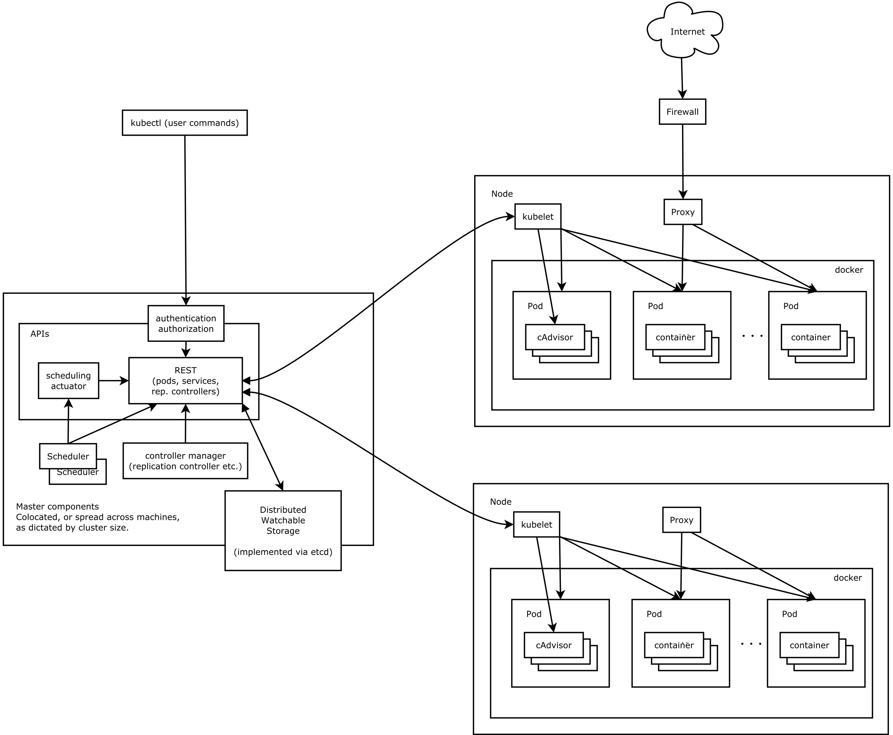
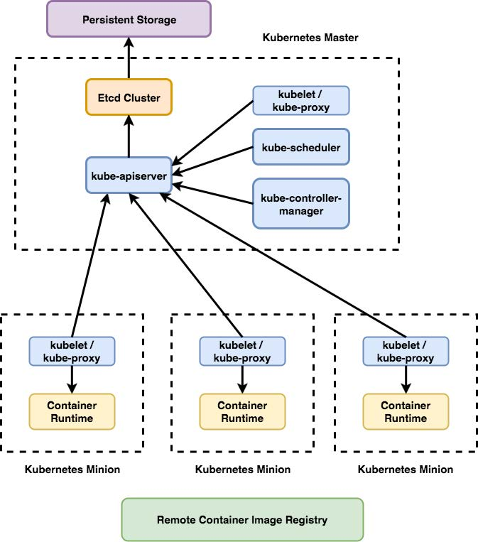
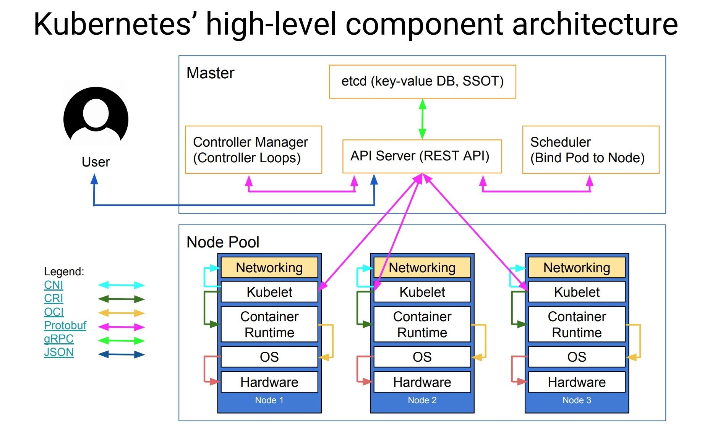

# kubernetes summary

## 1. 架构图

## 2. 核心组件介绍
Kubernetes主要由以下几个核心组件组成：
* etcd保存了整个集群的状态；
* apiserver提供了资源操作的唯一入口，并提供认证、授权、访问控制、API注册和发现等
* 机制；
* controller manager负责维护集群的状态，比如故障检测、自动扩展、滚动更新等；
* scheduler负责资源的调度，按照预定的调度策略将Pod调度到相应的机器上；
* kubelet负责维护容器的生命周期，同时也负责Volume（CSI）和网络（CNI）的管理；
* Container runtime负责镜像管理以及Pod和容器的真正运行（CRI）；
* kube-proxy负责为Service提供cluster内部的服务发现和负载均衡；

组件之间的通信：

https://www.youtube.com/playlist?list=PLAz0FOwiBi6tVRl4bPbs_G_ucM3N7a1ES

https://k8smeetup.github.io/docs/admin/high-availability/
https://blog.csdn.net/lovemysea/article/details/79184416
https://yq.aliyun.com/articles/218895
